# Raptor

## A Ruby 4 Web Server


_Joshua Young ([`@joshuay03`](https://github.com/joshuay03)) · Senior Software Engineer at [Buildkite](https://buildkite.com/)_

_On the [Rails](https://github.com/rails/rails), [Puma](https://github.com/puma/puma), and [Concurrent Ruby](https://github.com/ruby-concurrency/concurrent-ruby) maintainer teams_

_BrisRails · August 2026_

_[luma.com/t3l24s8h](https://luma.com/t3l24s8h)_

<br>
<br>
<br>
<br>
<br>
<br>
<br>
<br>

---

<br>
<br>
<br>
<br>
<br>
<br>
<br>
<br>

## Hi

- <big>I built a Ruby web server over the last few months</big>
- <big>It's called Raptor</big>
- <big>It runs Rack apps, like Puma and Falcon do</big>
- <big>It's built around a Ractor-parallel HTTP parser</big>
- <big>It's fast enough that the numbers are interesting</big>
- <big>It's not production-ready. Nobody's Rails app should be behind it yet.</big>

<br>
<br>
<br>
<br>
<br>
<br>
<br>
<br>

---

<br>
<br>
<br>
<br>
<br>
<br>
<br>
<br>

## What this talk is

- <big>A tour of what's inside Raptor</big>
- <big>Why I built it</big>
- <big>What I got to learn along the way</big>
- <big>A lot of technology Ruby people don't usually get to touch:</big>
  - Ractors, and what changed in Ruby 4
  - Compare-and-swap and lock-free data structures
  - Red-black trees
  - Anonymous shared memory via mmap
  - eBPF programs running inside the Linux kernel
- <big>Ruby APIs, native extensions, and one tiny BPF program, all working together in one server.</big>

<br>
<br>
<br>
<br>
<br>
<br>
<br>
<br>

---

<br>
<br>
<br>
<br>
<br>
<br>
<br>
<br>

## What's a web server, really

A web server is one process doing all of this:

- <big>Listens on a TCP port</big>
- <big>Accepts connections</big>
- <big>Reads bytes</big>
- <big>Parses those bytes into an HTTP request</big>
- <big>Hands the request to your Rack app</big>
- <big>Waits for a response</big>
- <big>Writes the response bytes back to the socket</big>
- <big>Closes the connection, or holds it open for another request</big>

Rails is not a web server. [Rack](https://github.com/rack/rack) is not a web server. Rack is a contract between web servers and Ruby apps.

<br>
<br>
<br>
<br>
<br>
<br>
<br>
<br>

---

<br>
<br>
<br>
<br>
<br>
<br>
<br>
<br>

## A Rack app

```ruby
# This is a complete Rack app. Nothing more is needed.
run ->(env) { [200, { "content-type" => "text/plain" }, ["hello\n"]] }
```

- <big>A callable object (something that responds to `#call`)</big>
- <big>Takes a `Hash` (the "Rack env")</big>
- <big>Returns `[status, headers, body]`</big>

That's the entire contract. Everything between the socket and that `#call` is the web server's problem.

<br>
<br>
<br>
<br>
<br>
<br>
<br>
<br>

---

<br>
<br>
<br>
<br>
<br>
<br>
<br>
<br>

## HTTP/1.1 in 60 seconds

For the folks who mostly know the Rails abstraction.

- <big>HTTP/1.1 is a text-based protocol</big>
- <big>One TCP connection carries one request at a time</big>
- <big>Keep-alive lets you send the next request on the same connection after the response comes back</big>
- <big>The request looks like this on the wire:</big>

```
GET /users/42 HTTP/1.1
Host: example.com
User-Agent: curl/8.0
Accept: application/json

```

- <big>The server parses those bytes into a `Hash` of headers and metadata</big>
- <big>Then writes a response in the same shape:</big>

```
HTTP/1.1 200 OK
Content-Type: application/json
Content-Length: 27

{"id":42,"name":"joshua"}
```

That's the entire protocol.

<br>
<br>
<br>
<br>
<br>
<br>
<br>
<br>

---

<br>
<br>
<br>
<br>
<br>
<br>
<br>
<br>

## Client and server, high-level

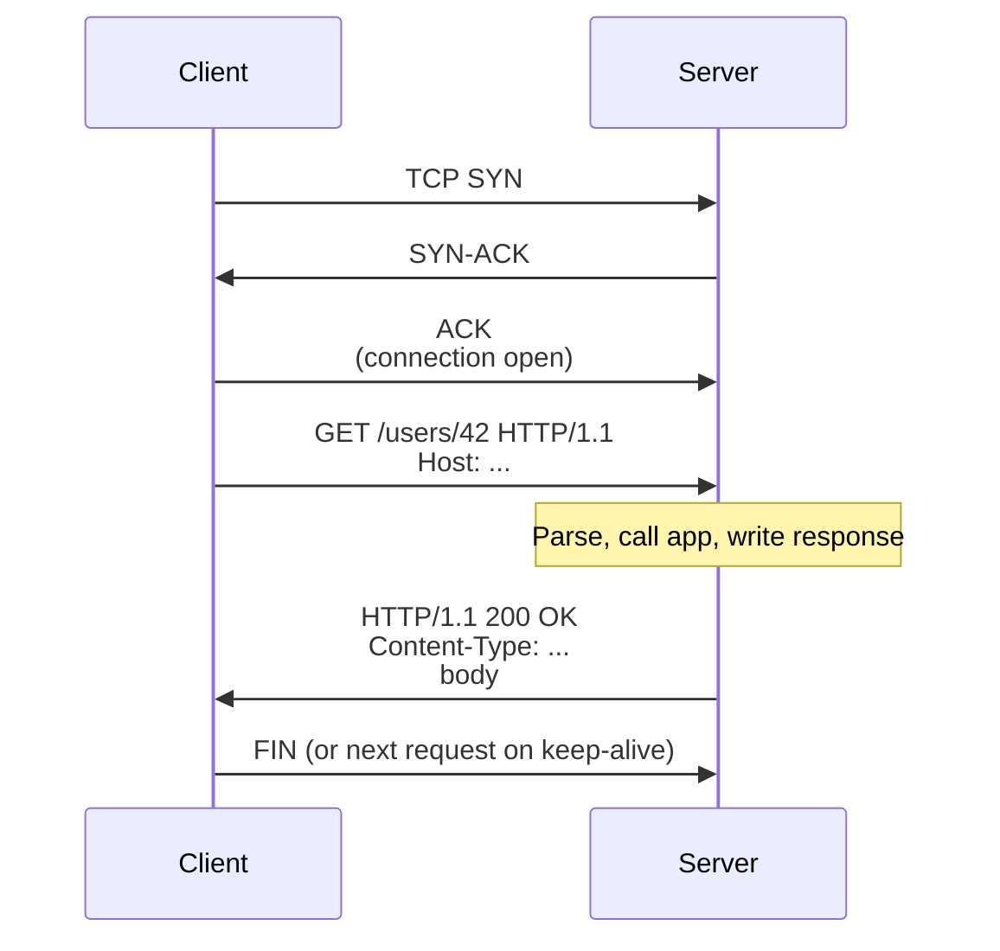

- <big>Set up a TCP connection</big>
- <big>Send the request</big>
- <big>Get the response</big>
- <big>Close, or send another</big>

That is all a web server has to do, per request.

One thing to note: the whole `SYN` → `SYN-ACK` → `ACK` handshake at the top is handled entirely by the kernel. The web server doesn't do any of that. It calls `accept()`, and the kernel hands it a socket that's already connected.

- <big>Kernel does the handshake and puts the completed connection on the listener's accept queue</big>
- <big>Server calls `accept_nonblock` to pull the next connection off the queue</big>
- <big>For Raptor's plain-TCP listener, the BPF program we'll see later can choose which worker socket receives each new connection</big>

<br>
<br>
<br>
<br>
<br>
<br>
<br>
<br>

---

<br>
<br>
<br>
<br>
<br>
<br>
<br>
<br>

## The two servers you already know

**[Puma](https://github.com/puma/puma)** (since 2011)

- <big>Multi-threaded, one process per worker</big>
- <big>One thread pool per worker</big>
- <big>Uses `Mutex` + `ConditionVariable` for the pool</big>
- <big>HTTP/1.1 only</big>
- <big>Battle-tested. It's the safe pick.</big>

**[Falcon](https://github.com/socketry/falcon)**

- <big>Lightweight async tasks backed by fibers instead of a fixed app thread pool</big>
  - Fibers are cooperatively scheduled coroutines and much cheaper to create than OS threads
- <big>Built on the [`async`](https://github.com/socketry/async) gem, mostly written by Samuel Williams ([`@ioquatix`](https://github.com/ioquatix))</big>
- <big>Speaks HTTP/2 natively</big>
- <big>Excellent at long-lived connections and streaming</big>
- <big>Works best when the whole app uses fiber-aware I/O (like `Async::HTTP::Client` for outgoing calls)</big>

Both are great servers. Both were designed and mostly written before Ractors existed.

<br>
<br>
<br>
<br>
<br>
<br>
<br>
<br>

---

<br>
<br>
<br>
<br>
<br>
<br>
<br>
<br>

## The Ruby 4 opening

- <big>Ruby 4 shipped last December</big>
- <big>Everyone talks about `it` as a block parameter</big>
- <big>The one that made me want to build a web server: **`Ractor::Port` stabilised**</big>
  - `Ractor::Port` is a message channel that any number of Ractors can send to and one receiver drains from
  - It's the primitive you need to build a pipeline where many workers produce results and one collector consumes them
  - Before Ruby 4 it was experimental and the API kept changing
- <big>Ractors themselves were experimental for four years</big>
  - API drifted between minor versions
  - Ergonomics were rough
  - Most Rubyists learned "Ractors exist" and then never touched them
- <big>In Ruby 4 the API has settled</big>
- <big>You can finally build against them without expecting them to break</big>

<br>
<br>
<br>
<br>
<br>
<br>
<br>
<br>

---

<br>
<br>
<br>
<br>
<br>
<br>
<br>
<br>

## The question I wanted to answer

What would a Ruby web server look like

- <big>if you took Ractors seriously</big>
- <big>instead of pretending the GVL was a fact of nature</big>

That's the pitch. The rest of the talk is how it went.

<br>
<br>
<br>
<br>
<br>
<br>
<br>
<br>

---

<br>
<br>
<br>
<br>
<br>
<br>
<br>
<br>

## Ractors 101

A Ractor is Ruby's answer to true parallelism.

- <big>Multiple Ractors run at the same time</big>
- <big>On different OS threads</big>
- <big>Each Ractor has its **own GVL**</big>

That last point is the whole thing.

- <big>Ruby's GVL is not process-wide</big>
- <big>It's Ractor-scoped</big>
- <big>Two Ractors can run Ruby code on two CPU cores at the same instant</big>
- <big>Actual parallelism, not just concurrency</big>

<br>
<br>
<br>
<br>
<br>
<br>
<br>
<br>

---

<br>
<br>
<br>
<br>
<br>
<br>
<br>
<br>

## The catch

Ractors are strict about what they can share.

```ruby
data = { name: "hello" }

Ractor.new do
  puts data
end
# ArgumentError: can not isolate a Proc because it accesses outer variables (data)
```

The Ractor's block is isolated. It cannot reach back into the outer scope. If you want the Ractor to see `data`, you have to pass it explicitly, and even then only certain values can cross:

- <big>Deeply frozen objects (`Ractor.make_shareable(hash)`)</big>
- <big>Immutable value types (`Integer`, `Symbol`, `true`, `false`, `nil`)</big>
- <big>Values sent as messages between Ractors (deep-copied by default)</big>
- <big>Values sent with `move: true` (ownership transferred, sender loses access)</big>
  - The runtime walks the object graph (the value and everything it references)
  - Transfers ownership of every reachable object to the receiving Ractor
  - The sender's references are replaced with a "moved" placeholder
  - Any subsequent access from the sender raises `Ractor::MovedError`
  - Cheaper than deep-copying for big object graphs, since the objects themselves aren't reallocated

Why so strict? Because shared mutable state plus true parallelism is where every data race bug lives. Ruby sidesteps the problem by refusing to let mutable state cross the boundary at all.

<br>
<br>
<br>
<br>
<br>
<br>
<br>
<br>

---

<br>
<br>
<br>
<br>
<br>
<br>
<br>
<br>

## Sending messages

```ruby
port = Ractor::Port.new

worker = Ractor.new(port) do |port|
  loop do
    data = Ractor.receive
    port.send("processed: #{data}")
  end
end

worker.send("hello")
puts port.receive       # "processed: hello"
worker.send("world")
puts port.receive       # "processed: world"
```

- <big>One Ractor sends work in via `Ractor.send`</big>
- <big>The Ractor block receives it via `Ractor.receive`</big>
- <big>Results go out through a `Ractor::Port`, which any number of Ractors can send to</big>
- <big>Ruby 4 is the first release where `Ractor::Port` is stable</big>
- <big>Every message crosses cleanly. Shareable values pass by reference, mutable values are deep-copied, and `move: true` transfers ownership.</big>

<br>
<br>
<br>
<br>
<br>
<br>
<br>
<br>

---

<br>
<br>
<br>
<br>
<br>
<br>
<br>
<br>

## The lesson

- <big>Ractors are **not** a drop-in "make it parallel" for existing code</big>
- <big>Almost no gem you use is Ractor-safe</big>
- <big>What Ractors are actually good for:</big>
  - Small, well-scoped chunks of CPU work
  - No global state to reach into
  - No gem coupling
  - A single hand-off boundary

And that description happens to fit HTTP parsing exactly.

<br>
<br>
<br>
<br>
<br>
<br>
<br>
<br>

---

<br>
<br>
<br>
<br>
<br>
<br>
<br>
<br>

## The idea

- <big>Puma parses HTTP on the app thread</big>
- <big>Same thread that's about to run your Rack app</big>
- <big>Both fight for the same one GVL</big>
- <big>Parsing time is stolen from your app</big>

If parsing runs in a Ractor:

- <big>It uses a **different GVL** than the app</big>
- <big>On a two-core machine, the parser and the app can run at the exact same instant</big>
- <big>Actual protocol and app parallelism inside one worker process</big>

That's the whole idea. Raptor uses that pipeline when a connection needs the reactor; complete requests on its eager paths parse inline instead of paying for a Ractor handoff.

<br>
<br>
<br>
<br>
<br>
<br>
<br>
<br>

---

<br>
<br>
<br>
<br>
<br>
<br>
<br>
<br>

## Raptor at a glance

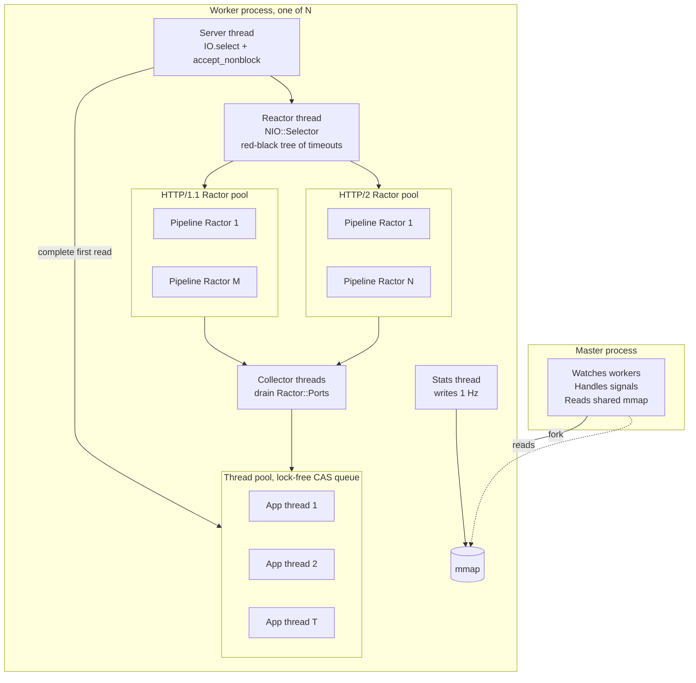

Every part earns its keep. Let's walk it.

<br>
<br>
<br>
<br>
<br>
<br>
<br>
<br>

---

<br>
<br>
<br>
<br>
<br>
<br>
<br>
<br>

## The Ractor pools

Parsing runs in dedicated Ractor pools, one per HTTP protocol. This is where the parallelism actually kicks in.

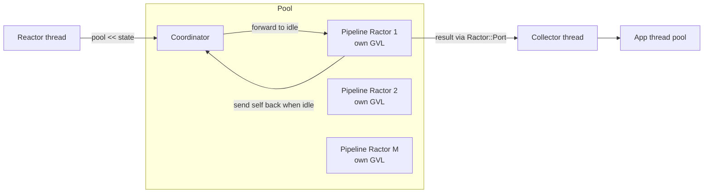

<br>
<br>
<br>
<br>
<br>
<br>
<br>
<br>

---

<br>
<br>
<br>
<br>
<br>
<br>
<br>
<br>

## Coordinator-dispatch

- <big>One coordinator Ractor</big>
- <big>M pipeline Ractors</big>
- <big>When a pipeline Ractor becomes idle, it sends **itself** back to the coordinator:</big>

```ruby
coordinator.send(Ractor.current, move: true)
```

- <big>The coordinator always knows exactly which Ractors are free</big>
- <big>When work arrives, the coordinator forwards it straight to a waiting Ractor</big>
- <big>No queueing, no polling, no idle spin</big>
- <big>Results flow back through a shared `Ractor::Port` (the many-to-one channel that stabilised in Ruby 4)</big>
- <big>A Ruby-side collector thread drains the port and dispatches to the app thread pool</big>

I pulled the pattern into its own gem: **`ractor-pool`**.

<br>
<br>
<br>
<br>
<br>
<br>
<br>
<br>

---

<br>
<br>
<br>
<br>
<br>
<br>
<br>
<br>

## The parser itself

- <big>Native C extension ([Ragel](https://www.colm.net/open-source/ragel/)-generated finite-state machine)</big>
  - Ragel is a tool that takes a state-machine spec and generates fast C parsing code from it
- <big>Declared Ractor-safe with `rb_ext_ractor_safe(true)`, a C API for extensions to tell the VM they're safe to call from any Ractor</big>
- <big>Holds no per-parser Ruby state in the extension</big>
- <big>Everything goes into the caller-supplied env `Hash`</big>
- <big>Interns the ~40 most common HTTP header keys once at load time</big>
  - "Interning" means creating one canonical `String` object for a value and reusing it forever
  - `HTTP_HOST`, `HTTP_USER_AGENT`, `HTTP_ACCEPT`, `CONTENT_LENGTH`, and so on
- <big>Every request's env `Hash` reuses the same `String` objects for its header names</big>
- <big>Skips per-request key allocation</big>
- <big>Lets Ruby's `Hash` use the interned `String`'s cached hash code</big>

<br>
<br>
<br>
<br>
<br>
<br>
<br>
<br>

---

<br>
<br>
<br>
<br>
<br>
<br>
<br>
<br>

## Two GVLs, in one picture

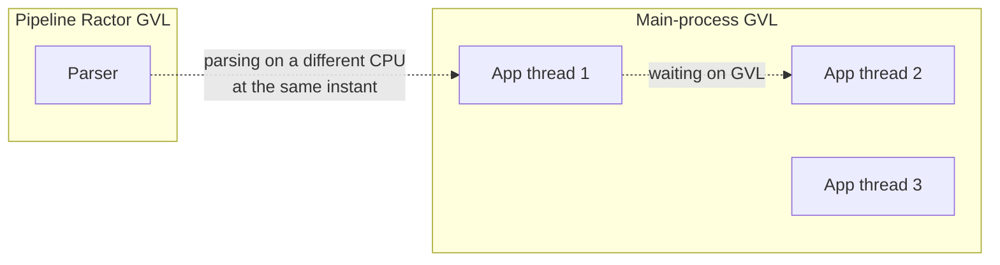

- <big>App threads share one GVL among themselves. Only one runs Ruby at a time.</big>
- <big>The pipeline Ractor has its own GVL. It runs Ruby independently.</big>
- <big>A pipeline Ractor and an app thread can run Ruby code at the same time, on two CPU cores</big>
- <big>That is not something you get out of the box in Ruby</big>

<br>
<br>
<br>
<br>
<br>
<br>
<br>
<br>

---

<br>
<br>
<br>
<br>
<br>
<br>
<br>
<br>

## The app thread pool

Where your Rack app runs, and where the response gets written back to the socket.

- <big>Puma's pool coordinates a Ruby `Queue` with `Mutex + ConditionVariable`</big>
- <big>Every enqueue and every dequeue takes the mutex</big>
- <big>Under low concurrency, it's fine</big>
- <big>Under contention, the mutex becomes a serialisation point</big>
- <big>All threads have to line up to touch the queue</big>

Raptor's pool is **lock-free on the hot path**.

To explain that, one minute on one atomic primitive.

<br>
<br>
<br>
<br>
<br>
<br>
<br>
<br>

---

<br>
<br>
<br>
<br>
<br>
<br>
<br>
<br>

## Compare-and-swap (CAS)

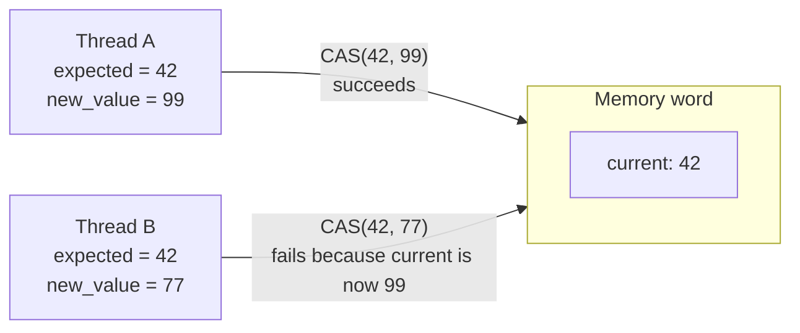

- <big>A hardware-supported atomic operation</big>
- <big>Reads a memory word</big>
- <big>Compares to what you expected</big>
- <big>If they match, replaces with a new value</big>
- <big>All atomically. No lock.</big>

On x86 it is commonly `LOCK CMPXCHG`. On ARM it is commonly an exclusive load/store pair such as `LDXR` / `STXR`.

<br>
<br>
<br>
<br>
<br>
<br>
<br>
<br>

---

<br>
<br>
<br>
<br>
<br>
<br>
<br>
<br>

## What CAS buys you

```ruby
# If @slot == expected, set @slot = new_value.
# Returns true if the swap happened, false if @slot changed.
cas(@slot, expected, new_value)
```

- <big>If a state transition can be published with CAS, threads do not need a lock for that transition</big>
- <big>If the CAS fails, you retry (someone else got there first)</big>
- <big>Many high-performance concurrent data structures are built on this</big>
  - Java's `ConcurrentHashMap`
  - Rust's `AtomicUsize`
  - Go's `sync/atomic`
- <big>[`concurrent-ruby`](https://github.com/ruby-concurrency/concurrent-ruby) has had CAS primitives (`AtomicReference`, `AtomicBoolean`, `AtomicFixnum`) since 2013</big>
  - I could have built around those primitives, but Raptor also needed a lock-free FIFO and lock-free waiter parking
  - I built that smaller, native set of pieces as `atomic-ruby`, with its C extension explicitly marked Ractor-safe

<br>
<br>
<br>
<br>
<br>
<br>
<br>
<br>

---

<br>
<br>
<br>
<br>
<br>
<br>
<br>
<br>

## CAS vs Mutex

**Mutex is the default for a reason**

- <big>Simple mental model: lock, do work, unlock</big>
- <big>Works for any-size critical section, touching any number of fields</big>
- <big>Fine at low contention</big>

But it has real costs:

- <big>Under contention, threads sleep and wait; the kernel context-switches them in and out</big>
- <big>Only one thread inside the critical section at a time, even for pure reads</big>
- <big>Priority inversion, and the risk of deadlock once you have more than one lock</big>

<br>
<br>
<br>
<br>
<br>
<br>
<br>
<br>

---

<br>
<br>
<br>
<br>
<br>
<br>
<br>
<br>

## When CAS is the better fit

CAS has its own costs too:

- <big>It only operates on one machine word at a time</big>
  - A machine word is one aligned chunk of memory the CPU can read or write in one go: 8 bytes on 64-bit CPUs, 4 on 32-bit
  - So one CAS can update one pointer, one integer, or one small value that fits in a word
  - You can't atomically update two independent fields of a bigger object with a single CAS
- <big>Retry loops can burn CPU when contention is extreme</big>
- <big>Harder to reason about than a mutex block</big>

Where it pays off:

- <big>Single-slot updates, like a queue head or an atomic counter</big>
- <big>State that's read a lot more often than it's written</big>
- <big>Hot paths where a mutex would become the scalability wall</big>

Why we picked CAS for Raptor's thread pool:

- <big>The queue can publish head, tail, and link changes through small atomic steps</big>
- <big>The server thread reads pool metrics on every accept iteration, thousands of times per second</big>
- <big>Under a queue-wide mutex, readers and writers serialise around the same lock</big>
- <big>Atomic counters avoid that lock. They still cost a synchronised memory access, but they do not park another thread.</big>

<br>
<br>
<br>
<br>
<br>
<br>
<br>
<br>

---

<br>
<br>
<br>
<br>
<br>
<br>
<br>
<br>

## atomic-ruby

Another gem I wrote. Native C extension. Exposes CAS-based primitives to Ruby:

- <big>`Atom` – a CAS-protected reference cell holding one Ruby value</big>
- <big>`AtomicBoolean` – a type-specialised boolean</big>
- <big>`AtomicQueue` – a multi-producer, multi-consumer FIFO</big>
- <big>`AtomicThreadPool` – the thread pool Raptor uses</big>
- <big>`AtomicConditionVariable` – lock-free waiter parking</big>

Ruby's `VALUE` type on 64-bit is a tagged pointer. It fits in one machine word, so the native extension can compare and replace the reference atomically.

```c
old = ATOMIC_VALUE_CAS(&atom->value, expected, new_value);
```

<br>
<br>
<br>
<br>
<br>
<br>
<br>
<br>

---

<br>
<br>
<br>
<br>
<br>
<br>
<br>
<br>

## The Michael-Scott queue

Raptor's thread pool uses a lock-free linked FIFO from `atomic-ruby`:

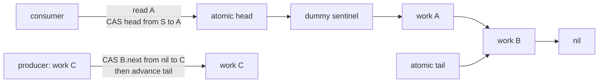

<br>
<br>
<br>
<br>
<br>
<br>
<br>
<br>

---

<br>
<br>
<br>
<br>
<br>
<br>
<br>
<br>

## Why this pattern works

- <big>A dummy node separates the queue's head position from its first value</big>
- <big>Producers append at the tail; consumers advance the head</big>
- <big>Multiple producers and consumers can make progress without one queue-wide lock</big>
- <big>Push and pop are O(1), with CAS retries when another thread wins a race</big>
- <big>Lock-free</big>
- <big>It's the Michael-Scott queue, a classic concurrent FIFO design</big>

The bit that matters most in practice:

- <big>Queue length and active count are tracked in separate atoms</big>
- <big>The server thread reads them every iteration of the accept loop</big>
- <big>Those reads do not acquire the queue's mutation lock, because there isn't one</big>
- <big>The values are point-in-time snapshots; they can change immediately after being read</big>

<br>
<br>
<br>
<br>
<br>
<br>
<br>
<br>

---

<br>
<br>
<br>
<br>
<br>
<br>
<br>
<br>

## Scaling app threads without making CPU contention worse

The pool starts at `threads` and scales automatically when more threads would help.

- <big>A native CRuby thread hook measures time running, blocked outside the GVL, and waiting for the GVL</big>
- <big>The queue has to stay non-empty, and every current worker has to be active</big>
- <big>Blocked time has to exceed half of worker time</big>
- <big>GVL wait has to stay below two percent</big>
- <big>Only then does the pool add a temporary thread</big>
- <big>When the queue drains, temporary threads leave and the pool returns to `threads`</big>

The distinction matters. More threads help when requests are asleep in database or network calls. They make CPU-bound Ruby slower when the GVL is already the bottleneck.

Growth has no fixed limit by default. Set `max_threads` to cap it, or set it to `threads` to keep the pool fixed. OS threads still are not as cheap as fibers.

Raptor clears application thread locals when each request finishes. Running every request in a fresh Fiber is also available when an application needs Fiber-local isolation. Parser and response buffers are kept separately so the server can still reuse them without carrying application state into the next request.

<br>
<br>
<br>
<br>
<br>
<br>
<br>
<br>

---

<br>
<br>
<br>
<br>
<br>
<br>
<br>
<br>

## The reactor

- <big>Every network server has to track connections that are open but not yet ready to be read</big>
- <big>Slow clients, half-sent requests, idle keep-alive sockets</big>
- <big>That's the reactor's job</big>

Raptor's reactor runs `NIO::Selector`, from the [`nio4r`](https://github.com/socketry/nio4r) library.

- <big>`nio4r` is a Ruby wrapper around the operating system's efficient "wait on many sockets at once" APIs</big>
- <big>On Linux it uses `epoll`, on macOS/BSD it uses `kqueue`</big>
- <big>Puma uses the same library for the same purpose</big>

Where Raptor diverges from Puma is the data structure it uses for timeouts.

<br>
<br>
<br>
<br>
<br>
<br>
<br>
<br>

---

<br>
<br>
<br>
<br>
<br>
<br>
<br>
<br>

## Tracking timeouts

**Puma**

- <big>Plain Ruby `Array` of clients</big>
- <big>Sorted by deadline after each batch of inserts</big>
- <big>Sort is O(n log n)</big>
- <big>Removing a specific client is a linear scan, O(n)</big>
- <big>Fine at tens of connections. Linear at thousands.</big>

**Raptor**

- <big>Red-black tree</big>
- <big>Insert: O(log n)</big>
- <big>Remove by key: O(log n)</big>
- <big>Walk earliest-first, break on the first non-expired node</big>

At 100 connections it's a wash. At 1000+, the difference is real.

<br>
<br>
<br>
<br>
<br>
<br>
<br>
<br>

---

<br>
<br>
<br>
<br>
<br>
<br>
<br>
<br>

## Red-black tree

A self-balancing binary search tree.

- <big>Every operation (insert, delete, lookup, min) is O(log n)</big>
- <big>Five invariants that keep it balanced:</big>
  1. Every node is either red or black
  2. The root is black
  3. Red nodes have black children (no two reds in a row)
  4. Every path from a node to a leaf has the same number of black nodes
  5. Leaves are black
- <big>Insertion adds a red node, then rotates and recolors to restore the invariants</big>

It's the data structure behind `TreeMap` in Java and `std::map` in C++.

<br>
<br>
<br>
<br>
<br>
<br>
<br>
<br>

---

<br>
<br>
<br>
<br>
<br>
<br>
<br>
<br>

## The reactor's tree

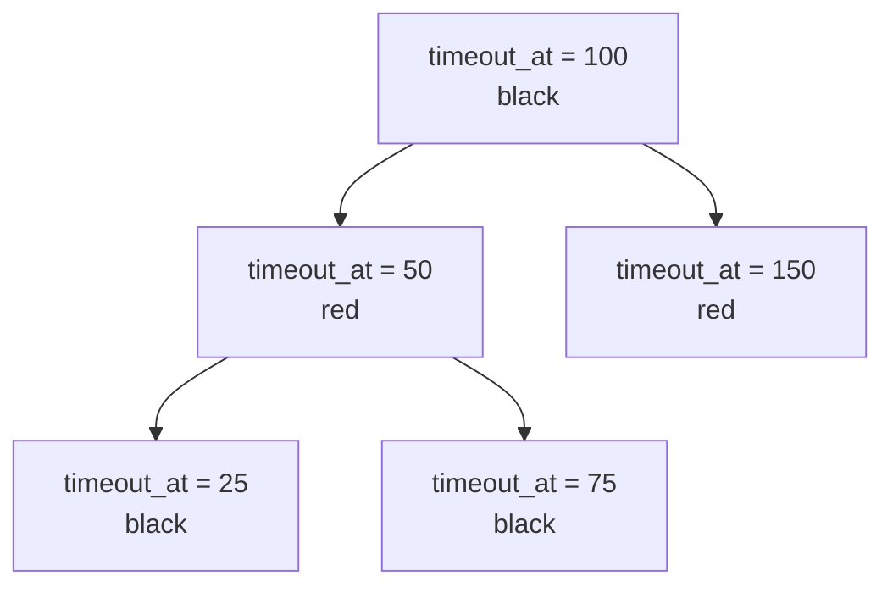

- <big>Each node is a `TimeoutClient < RedBlackTree::Node`</big>
- <big>Ordered by `timeout_at` (a monotonic float)</big>
- <big>Every read on a socket resets its deadline: delete + reinsert</big>
- <big>That's what makes the tree beat a min-heap</big>
  - Heap peek is O(1), but arbitrary delete is O(n) because you have to find the node
  - Tree delete-by-key is O(log n)

<br>
<br>
<br>
<br>
<br>
<br>
<br>
<br>

---

<br>
<br>
<br>
<br>
<br>
<br>
<br>
<br>

## The three timeouts

- <big>**`first_data_timeout` (30s)** – applied to a fresh connection with no bytes read yet</big>
- <big>**`chunk_data_timeout` (10s)** – applied once data has started arriving but the request is incomplete</big>
- <big>**`persistent_data_timeout` (65s)** – applied to a keep-alive socket sitting idle between requests</big>

On timeout: write `HTTP/1.1 408 Request Timeout` and close.

I pulled the tree out into its own gem: **`red-black-tree`**.

<br>
<br>
<br>
<br>
<br>
<br>
<br>
<br>

---

<br>
<br>
<br>
<br>
<br>
<br>
<br>
<br>

## The full request lifecycle

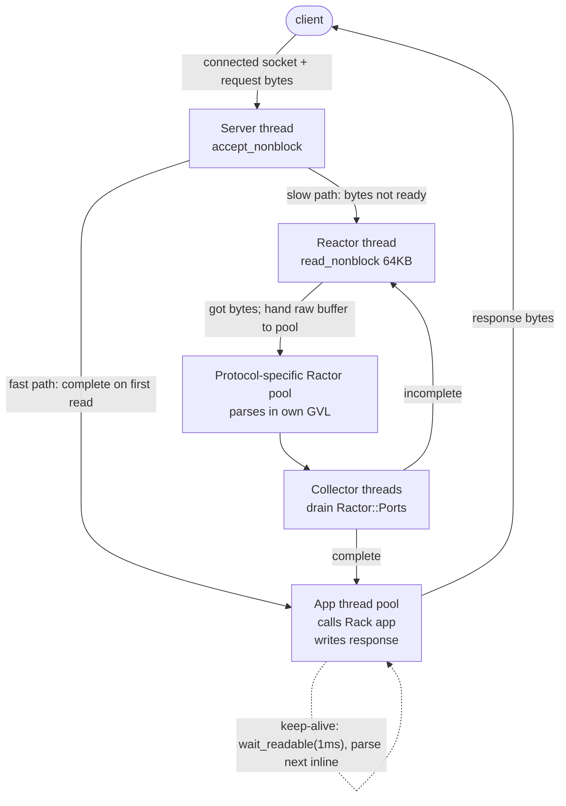

<br>
<br>
<br>
<br>
<br>
<br>
<br>
<br>

---

<br>
<br>
<br>
<br>
<br>
<br>
<br>
<br>

## Two paths through Raptor

**Fast path**

- <big>First `read_nonblock` gives us a complete request</big>
- <big>Server thread (HTTP/1.1) or accepting pool worker (HTTP/2) parses inline</big>
- <big>Pushes a proc to the app pool</big>
- <big>No reactor. No Ractor pool.</big>
- <big>Common for a normal request that fits in one TCP packet.</big>

**Slow path**

- <big>Bytes not ready, or the request is incomplete</big>
- <big>Reactor takes over, waits for more bytes</big>
- <big>When bytes arrive: read up to 64KB per syscall, hand the buffer to the protocol's Ractor pool</big>
  - 64KB is the per-read size, not a request size limit. Bigger requests just come in over more reads.
- <big>Ractor parses on a **separate GVL**</big>
- <big>Parsed env comes back via the collector, which pushes to the app pool</big>

<br>
<br>
<br>
<br>
<br>
<br>
<br>
<br>

---

<br>
<br>
<br>
<br>
<br>
<br>
<br>
<br>

## The eager keep-alive loop

After writing a response, if keep-alive is on:

```ruby
loop do
  unless socket.wait_readable(0.001) # 1 millisecond
    reactor.persist(socket, id, ...)
    return
  end

  # Bytes arrived. Parse the next request inline on this thread.
  # ...
end
```

- <big>Wait 1ms for the next request on the same connection</big>
- <big>If bytes arrive in that window: parse and dispatch inline, on the same thread</big>
- <big>Return to the reactor when no bytes arrive inside the 1ms window, or when a request is incomplete</big>
- <big>The trade: occupy an app thread for up to 1ms to widen the no-reactor fast path</big>

<br>
<br>
<br>
<br>
<br>
<br>
<br>
<br>

---

<br>
<br>
<br>
<br>
<br>
<br>
<br>
<br>

## HTTP/2 in 60 seconds

For folks who mostly know HTTP/1.

**HTTP/1's limits**

- <big>One request at a time per connection</big>
- <big>Head-of-line blocking (a slow response blocks the next one)</big>
- <big>Text-based headers, repeated on every request, often kilobytes</big>

**HTTP/2 fixes**

- <big>**Binary framing**: the wire is small binary frames, not text</big>
- <big>**Multiplexing**: many "streams" over one TCP connection, in parallel</big>
- <big>**Header compression**: HPACK reuses previously-seen headers as small indexes</big>
- <big>**Priorities and flow control**: server can send frames from many streams and negotiate windows</big>

One socket, many concurrent requests. Matters most when a client makes many small requests to the same server.

<br>
<br>
<br>
<br>
<br>
<br>
<br>
<br>

---

<br>
<br>
<br>
<br>
<br>
<br>
<br>
<br>

## HTTP/2 multiplexing

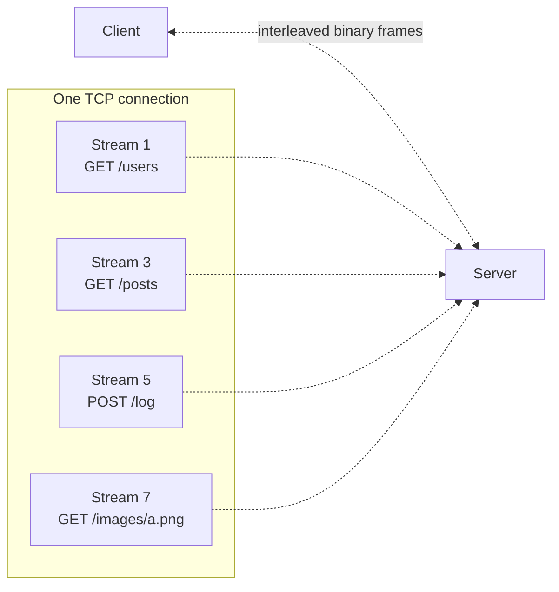

- <big>Four requests in flight</big>
- <big>One TCP connection</big>
- <big>Frames from different streams are interleaved on the wire</big>
- <big>Both sides reassemble by stream ID</big>

<br>
<br>
<br>
<br>
<br>
<br>
<br>
<br>

---

<br>
<br>
<br>
<br>
<br>
<br>
<br>
<br>

## HTTP/2 in Raptor

- <big>Native, on TLS connections</big>
- <big>ALPN picks `h2` during the TLS handshake if the client offers it</big>
  - ALPN stands for Application-Layer Protocol Negotiation
  - It's a small step in the TLS handshake where client and server agree on which protocol to speak over the encrypted connection
- <big>HPACK header compression, static Huffman table</big>
  - HPACK is HTTP/2's header compression scheme; it keeps a shared table of previously-seen headers so subsequent references are one small integer instead of the full header
- <big>Own Ractor-safe C parser: `raptor_http2`</big>
- <big>Puma [doesn't do HTTP/2](https://github.com/puma/puma/issues/2697), because they see it belonging at the edge (nginx, Caddy, ALB). Falcon does.</big>

Notable: a single HTTP/2 client connection in Raptor can have many streams in flight at once, spread across the app thread pool.

- <big>Each stream is a separate work item in the queue</big>
- <big>Different streams from the same connection can end up on different app threads</big>
- <big>Those threads still share the main GVL, so they overlap productively when the app is in I/O (the common Rails case), the same way Puma's keep-alive requests do</big>
- <big>On the reactor path, frame batches parse in the HTTP/2 Ractor pool on its own GVL, in parallel with app work</big>

<br>
<br>
<br>
<br>
<br>
<br>
<br>
<br>

---

<br>
<br>
<br>
<br>
<br>
<br>
<br>
<br>

## The frame writer

- <big>One HTTP/2 connection carries many streams</big>
- <big>Many app threads may be trying to write frames for their stream at once</big>
- <big>Naïve: one mutex per connection. Contention grows with concurrent streams.</big>

Raptor stores the "pending frames" queue in an `Atom`:

- <big>Value is either `:idle` or an array of frames waiting to go out</big>
- <big>A thread that wants to write does a CAS:</big>
  - If value is `:idle`: claim the writer, drain until empty
  - If value is an array: append your frames and return immediately. The current writer will pick them up.
- <big>Only one thread does socket I/O at a time (a socket can only be written serially anyway)</big>
- <big>But no thread ever blocks on a lock</big>

Same pattern for per-stream flow-control windows.

<br>
<br>
<br>
<br>
<br>
<br>
<br>
<br>

---

<br>
<br>
<br>
<br>
<br>
<br>
<br>
<br>

## Shared state

The master needs to know what the workers are doing.

- <big>Are they alive?</big>
- <big>How busy?</big>
- <big>Have they crashed?</big>

**Puma**: pipes. Workers write status messages every check interval. Master reads.

**Raptor**: anonymous shared memory via `mmap`.

<br>
<br>
<br>
<br>
<br>
<br>
<br>
<br>

---

<br>
<br>
<br>
<br>
<br>
<br>
<br>
<br>

## What is mmap?

- <big>`mmap(2)` is a system call</big>
- <big>Asks the kernel for a region of virtual memory backed by something</big>
- <big>Common uses:</big>
  - **File-backed**: mapping a file into memory (like Postgres's shared buffers)
  - **Anonymous** (`MAP_ANONYMOUS`): backed by nothing, just zero-filled pages
- <big>The `MAP_SHARED` flag tells the kernel writes should be visible to other processes that also have the mapping</big>

<br>
<br>
<br>
<br>
<br>
<br>
<br>
<br>

---

<br>
<br>
<br>
<br>
<br>
<br>
<br>
<br>

## Anonymous shared memory

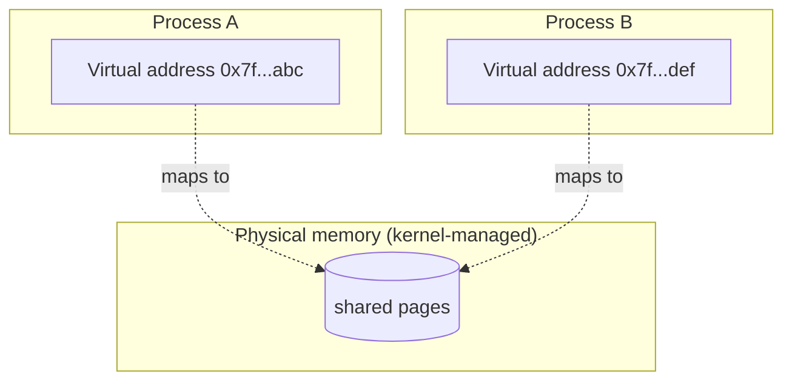

- <big>Two processes call `mmap(MAP_ANONYMOUS | MAP_SHARED)` on the same region</big>
- <big>Or, more usefully: **one process calls `mmap`, then forks**</big>
- <big>Both processes end up with virtual addresses that point at the same physical pages</big>
- <big>A write in process A is visible in process B, immediately</big>
- <big>No syscalls to synchronise. It's just memory.</big>

<br>
<br>
<br>
<br>
<br>
<br>
<br>
<br>

---

<br>
<br>
<br>
<br>
<br>
<br>
<br>
<br>

## Raptor's stats via mmap

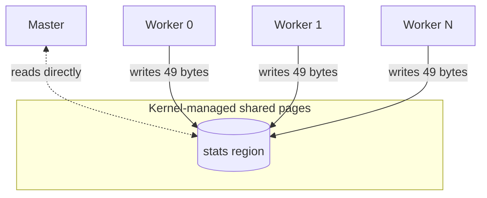

- <big>Master calls `mmap` for the region **before** forking</big>
- <big>Every worker inherits the mapping</big>
- <big>Each worker writes a 49-byte slot every second: pid, phase, requests, backlog, busy and available threads, boot time, checkin time, booted flag</big>
- <big>Master reads the whole region directly. No JSON. No pipe drain. No signal.</big>
- <big>`bundle exec raptor stats` prints the region as JSON, essentially instantly</big>

Wrapped in a small C extension I wrote: **`mmap-ruby`**.

<br>
<br>
<br>
<br>
<br>
<br>
<br>
<br>

---

<br>
<br>
<br>
<br>
<br>
<br>
<br>
<br>

## But how do the writes not clash?

Fair question. This is shared memory. What stops two workers from stepping on each other?

**The layout does the work**

- <big>Each worker owns exactly one slot in the region</big>
  - Slot address = base + (worker index × 49 bytes)
- <big>Only that one worker ever writes to that slot</big>
- <big>The master only ever reads. It never writes.</big>
- <big>No two writers touch the same bytes, so there is no write-write contention</big>

**What about a read happening mid-write?**

- <big>The master can see a slot half-updated: a "torn read"</big>
- <big>For stats, that's fine</big>
- <big>These are eventually-consistent metrics, not authoritative state</big>
- <big>The next second's checkin makes it right</big>

**If we did need atomicity**

- <big>We'd use atomic word writes (like the BPF load map does)</big>
- <big>Or a per-slot version counter the reader could double-check</big>
- <big>Neither is worth the complexity for stats</big>

<br>
<br>
<br>
<br>
<br>
<br>
<br>
<br>

---

<br>
<br>
<br>
<br>
<br>
<br>
<br>
<br>

## Load-aware routing

This is my favourite piece.

The problem:

- <big>N workers all bind the same TCP port with `SO_REUSEPORT`</big>
  - `SO_REUSEPORT` is a socket option that lets multiple processes bind the same port at the same time
  - The kernel treats them as a group and hands out incoming connections between them
- <big>Kernel picks which listener gets each incoming SYN</big>
  - "SYN" is the first packet of a new TCP connection
- <big>Default is a deterministic hash of the connection's four-tuple (client IP, client port, server IP, server port)</big>
  - Same four-tuple always lands on the same worker. Not random. Not round-robin.
  - Good spread on average across many clients, but no awareness of which worker is actually busy

The Linux answer since kernel 4.5: **attach a BPF program to the reuseport group** via the `SO_ATTACH_REUSEPORT_EBPF` socket option. When the kernel selects a socket from that group for a new connection, your program can make the choice.

Raptor uses this for plain `tcp://` listeners. TLS and Unix listeners continue to use sockets inherited from the master.

<br>
<br>
<br>
<br>
<br>
<br>
<br>
<br>

---

<br>
<br>
<br>
<br>
<br>
<br>
<br>
<br>

## What Puma does instead

Puma has [`ClusterAcceptLoopDelay`](https://github.com/puma/puma/blob/master/lib/puma/cluster_accept_loop_delay.rb) since Puma 7.

- <big>Before each accept, a worker sleeps for a fraction of `max_delay` (default 5ms)</big>
- <big>The sleep is proportional to the worker's own load: 0 when idle, `max_delay` when very busy</big>
- <big>Every worker still accepts. Nobody refuses. Nobody gets skipped.</big>
- <big>Busier workers wake later. Less-busy workers wake first and win the accept race on the listener inherited from Puma's master.</big>

It's clever, portable, and deliberately imprecise. Each worker only needs its own load. Raptor's BPF path instead publishes cluster-wide load to a kernel map and chooses before a worker calls `accept`.

<br>
<br>
<br>
<br>
<br>
<br>
<br>
<br>

---

<br>
<br>
<br>
<br>
<br>
<br>
<br>
<br>

## What is BPF?

- <big>BPF stands for Berkeley Packet Filter (historical name from packet capture)</big>
- <big>Now it's a small virtual machine inside the Linux kernel</big>
- <big>Programs written in a restricted subset of C</big>
- <big>Compiled with `clang -target bpf` to BPF bytecode</big>
- <big>Kernel **verifies** the program before letting it run:</big>
  - Bounded loops
  - No out-of-bounds memory access
  - Provably terminates
- <big>If any of that can't be proved, the program is rejected at load time</big>
- <big>Once loaded, runs inside the kernel without a userspace round-trip for each decision</big>

Modern Linux observability (`bcc`, `bpftrace`, `cilium`, `perf`) is all built on this. It's genuinely one of the most exciting things that has happened to Linux in the last decade.

<br>
<br>
<br>
<br>
<br>
<br>
<br>
<br>

---

<br>
<br>
<br>
<br>
<br>
<br>
<br>
<br>

## Raptor's BPF program

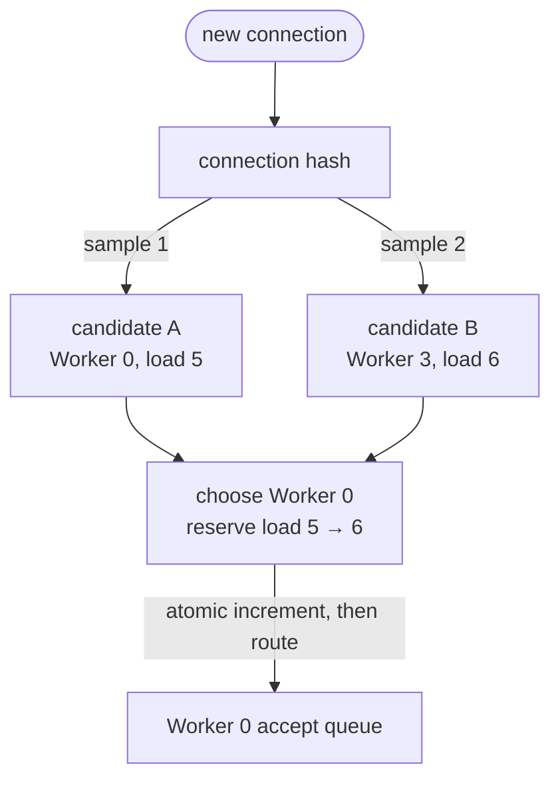

- <big>Each worker has a **load reporter thread**</big>
- <big>Publishes its current backlog into a BPF map every millisecond</big>
- <big>The connection hash picks two distinct workers</big>
- <big>The BPF program compares those two load slots and chooses the lower one</big>
- <big>That is **power of two choices**: near-global balance without scanning every worker</big>

<br>
<br>
<br>
<br>
<br>
<br>
<br>
<br>

---

<br>
<br>
<br>
<br>
<br>
<br>
<br>
<br>

## Why the reservation matters

The reporter only publishes once per millisecond. A burst can contain many connections.

- <big>Without a reservation, every connection in that burst can observe the same stale low value</big>
- <big>They can all choose the same worker before Ruby reports the new backlog</big>
- <big>Raptor atomically increments the chosen BPF slot **before** routing</big>
- <big>The next connection sees that reservation immediately</big>
- <big>When Ruby accepts a socket, it also publishes `backlog + 1` rather than waiting for the reporter</big>

The load number is partly measurement and partly admission ledger. That closes the stale-reporting window that caused herding in the earlier design.

<br>
<br>
<br>
<br>
<br>
<br>
<br>
<br>

---

<br>
<br>
<br>
<br>
<br>
<br>
<br>
<br>

## BPF in Raptor, by the numbers

- <big>The whole BPF program is under 70 lines of C</big>
- <big>Compiles down to a few hundred bytes of BPF bytecode</big>
- <big>Runs in the kernel whenever the reuseport group selects a socket for a new connection</big>
- <big>To load it from Ruby, I wrote **`libbpf-ruby`**</big>
  - `libbpf` is the standard C library that user-space programs use to load, verify and attach BPF programs
  - `libbpf-ruby` is my binding around it
- <big>As far as I know, it's the only Ruby binding for libbpf</big>

Graceful fallback:

- <big>If `libbpf-ruby` isn't installed, or the BPF object hasn't been compiled, Raptor silently falls back to the listener inherited from the master</big>
- <big>Everything still works. You just don't get load-aware routing.</big>
- <big>If the kernel refuses the program (verifier error, missing features), startup raises. Loud failure, not silent misbehaviour.</big>

<br>
<br>
<br>
<br>
<br>
<br>
<br>
<br>

---

<br>
<br>
<br>
<br>
<br>
<br>
<br>
<br>

## Zooming out: the master process

We've walked every worker-side thing Raptor does. mmap and BPF are two of the pieces the master itself owns and hands to workers at boot. Let me close out with the rest of that master-side story.

<br>
<br>
<br>
<br>
<br>
<br>
<br>
<br>

---

<br>
<br>
<br>
<br>
<br>
<br>
<br>
<br>

## Preforking

Every clustered Ruby web server does this pattern:

- <big>Master process boots</big>
- <big>Master loads your Rack app</big>
- <big>Master forks N worker processes</big>
- <big>Workers inherit the loaded app</big>

Why load in the master? Copy-on-write.

**In Raptor, this is always on**

- <big>No knob to turn it off</big>
- <big>Your Rack app has to be fork-safe: no threads at load time, no file handles that need to survive the fork, no global connections opened during `require`</big>
- <big>Puma had this as opt-in until v7. Raptor's opinionated on it.</big>

<br>
<br>
<br>
<br>
<br>
<br>
<br>
<br>

---

<br>
<br>
<br>
<br>
<br>
<br>
<br>
<br>

## Fork and copy-on-write

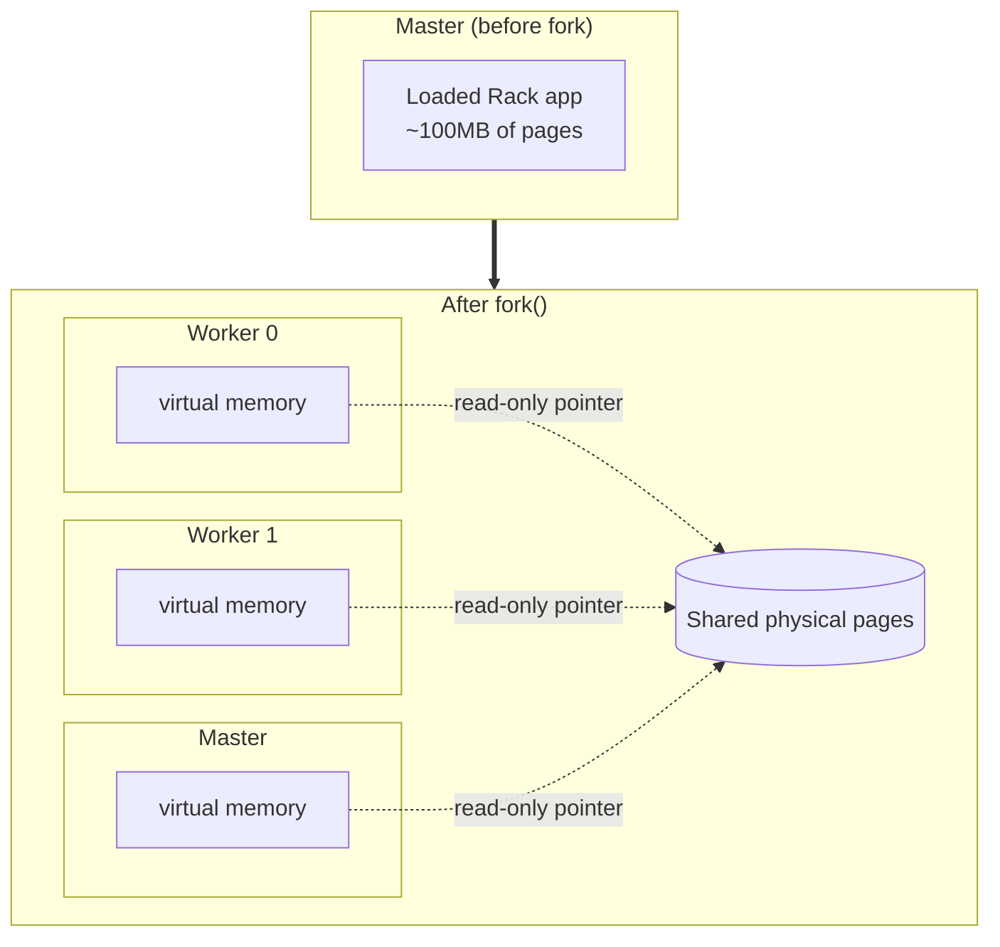

- <big>All three processes point at the same physical memory</big>
- <big>Nobody is using 100MB each. They share the 100MB.</big>
- <big>The moment any of them writes to a page, the kernel copies just that page for the writer</big>
- <big>So the shared memory stays shared until someone dirties it</big>

On a real Rails app, this saves gigabytes at startup.

<br>
<br>
<br>
<br>
<br>
<br>
<br>
<br>

---

<br>
<br>
<br>
<br>
<br>
<br>
<br>
<br>

## Refork

- <big>Copy-on-write savings decay over time</big>
- <big>Workers dirty pages as they serve traffic</big>
- <big>Allocations, YJIT-compiled blocks (YJIT is Ruby's in-process JIT compiler), gem lazy-loads, cache warm-up</big>
- <big>After a few hours, each worker's memory has climbed toward its full RSS</big>
  - RSS is "resident set size", the amount of physical memory the process is actually using
- <big>The saving from preloading is mostly gone</big>

The classic solution: **refork off a worker that's been serving traffic**, not off the master.

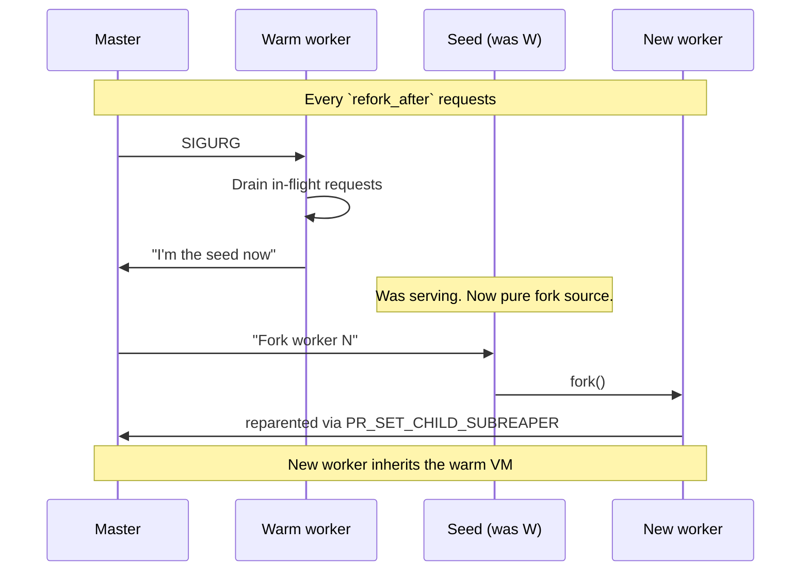

- <big>`SIGURG` is one of the Unix signals a process can trap, chosen here because nothing else uses it</big>
- <big>The pattern was invented by Shopify's [Pitchfork](https://github.com/Shopify/pitchfork)</big>
- <big>Puma is catching up to the same idea via Instacart's [`mold_worker` PR](https://github.com/puma/puma/pull/3643)</big>
- <big>Raptor's version is native, controlled by a `refork_after` config option</big>

<br>
<br>
<br>
<br>
<br>
<br>
<br>
<br>

---

<br>
<br>
<br>
<br>
<br>
<br>
<br>
<br>

## The subreaper trick

- <big>Normally, a process's children reparent to `init` (PID 1) when the direct parent dies</big>
  - `init` is the very first process the kernel starts; its job is to "adopt" orphaned processes
- <big>Linux has a syscall: `prctl(PR_SET_CHILD_SUBREAPER)`</big>
  - A syscall is a request from a program to the kernel to do something the program can't do itself
- <big>Marks a process as an "alternate reaper"</big>
- <big>Grandchildren reparent to *it* instead of `init`</big>
- <big>That's how the master keeps tracking workers forked by a seed, not directly</big>

Wrapped in a tiny C extension I wrote called `raptor_native`.

Linux-only. On macOS, `refork_after` is ignored with a warning at boot.

<br>
<br>
<br>
<br>
<br>
<br>
<br>
<br>

---

<br>
<br>
<br>
<br>
<br>
<br>
<br>
<br>

## The gem-shed

The libraries that came out of building Raptor:

- <big>**`atomic-ruby`** – CAS-based primitives (`Atom`, `AtomicThreadPool`, ...)</big>
- <big>**`ractor-pool`** – coordinator-dispatch pool for Ractor-based pipelines</big>
- <big>**`red-black-tree`** – self-balancing binary search tree</big>
- <big>**`mmap-ruby`** – `mmap(2)` binding for cross-process shared memory</big>
- <big>**`libbpf-ruby`** – `libbpf` binding, load and attach BPF programs from Ruby</big>

Each of them is small, focused, tested, and useful outside of Raptor.

- <big>If you want lock-free primitives in Ruby, `atomic-ruby` gives you a small, direct API</big>
- <big>If you want to try Ractor-based parallelism without writing the coordination yourself, `ractor-pool` is that</big>
- <big>If you want to load a BPF program from Ruby, `libbpf-ruby` gives you a direct binding to libbpf</big>

I didn't set out to build a small library ecosystem. It's what happens when you refuse to fold every helper back into the main gem.

<br>
<br>
<br>
<br>
<br>
<br>
<br>
<br>

---

<br>
<br>
<br>
<br>
<br>
<br>
<br>
<br>

## The numbers, in shape

Real numbers are in the [README benchmarks section](../README.md#micro-benchmarks). The shape:

- <big>**IO-bound HTTP/1.1**: Scaling lifts Raptor from 3.11k to 8.63k req/s without keep-alive and from 3.21k to 9.43k with it. Falcon wins the first; Raptor wins the second.</big>
- <big>**CPU-bound HTTP/1.1**: Fixed and scaling Raptor are effectively identical. Puma leads by 5% without keep-alive and less than 1% with it; Raptor leads Falcon.</big>
  - Tail latency ("p95") is the response time that 5% of requests exceed. It's what your slowest users see. Lower is better.
- <big>**HTTP/2**: Scaling lifts Raptor from 1.14k to 4.46k req/s on IO and narrows Falcon's CPU-throughput lead from 27% to 14%. Falcon still leads throughput; Raptor has the lower CPU p95.</big>
- <big>**Variance**: HTTP/1.1 is stable. HTTP/2 is noisy enough that I treat it as direction, not a precise ranking.</big>

Different workloads, different winners. That's fine.

<br>
<br>
<br>
<br>
<br>
<br>
<br>
<br>

---

<br>
<br>
<br>
<br>
<br>
<br>
<br>
<br>

## What you give up

**Battle-tested**

- <big>Puma has been in production Rails since 2011</big>
- <big>Raptor has been running my benchmarks since 2026</big>
- <big>Those are not the same thing.</big>

**Ruby version**

- <big>Raptor needs Ruby 4.0</big>
- <big>`Ractor::Port` and Ractor internals only just stabilised</big>
- <big>If you're on 3.x, Raptor isn't for you yet</big>

**Debugging is harder**

- <big>Control flow crosses Ractor and thread boundaries</big>
- <big>Tracing a request end-to-end means stitching several stack traces together</big>
- <big>Real cost of the architecture, not a temporary bug</big>

<br>
<br>
<br>
<br>
<br>
<br>
<br>
<br>

---

<br>
<br>
<br>
<br>
<br>
<br>
<br>
<br>

## Why you should try it

I'm not asking you to swap your production Rails deploy tomorrow. I'm asking you to be curious.

- <big>Ruby 4 landed</big>
- <big>Ractors are stable now</big>
- <big>`Ractor::Port` is stable</big>
- <big>We can compile BPF programs and load them from Ruby</big>
- <big>We can `mmap(MAP_ANONYMOUS)` for cross-process shared memory</big>
- <big>We can build lock-free data structures via CAS in Ruby</big>
- <big>We can wire syscalls like `prctl` and `sched_setaffinity` into native extensions in a few dozen lines of C</big>

Every one of these was possible individually before. What's new is that it's now practical to combine them.

Raptor is what happens when you take that seriously and build a web server that isn't shaped by the constraints of Ruby 2.

<br>
<br>
<br>
<br>
<br>
<br>
<br>
<br>

---

<br>
<br>
<br>
<br>
<br>
<br>
<br>
<br>

## Try it

- <big>`gem install raptor` (Ruby 4.0+)</big>
- <big>`bundle exec raptor` to boot your Rack app</big>
- <big>CLI mirrors Puma's conventions on purpose</big>
- <big>Feedback welcome</big>
- <big>Bug reports very welcome</big>

If you want the long-form of this talk with more diagrams and more depth, the design doc lives at [`docs/raptor-vs-puma.md`](raptor-vs-puma.md) in the repo.

<br>
<br>
<br>
<br>
<br>
<br>
<br>
<br>

---

<br>
<br>
<br>
<br>
<br>
<br>
<br>
<br>

## Thanks

**Raptor**

[github.com/joshuay03/raptor](https://github.com/joshuay03/raptor)

**The gems**

- <big>[atomic-ruby](https://github.com/joshuay03/atomic-ruby)</big>
- <big>[ractor-pool](https://github.com/joshuay03/ractor-pool)</big>
- <big>[red-black-tree](https://github.com/joshuay03/red-black-tree)</big>
- <big>[mmap-ruby](https://github.com/joshuay03/mmap-ruby)</big>
- <big>[libbpf-ruby](https://github.com/joshuay03/libbpf-ruby)</big>

**Design doc**

[docs/raptor-vs-puma.md](raptor-vs-puma.md)

_Questions?_
