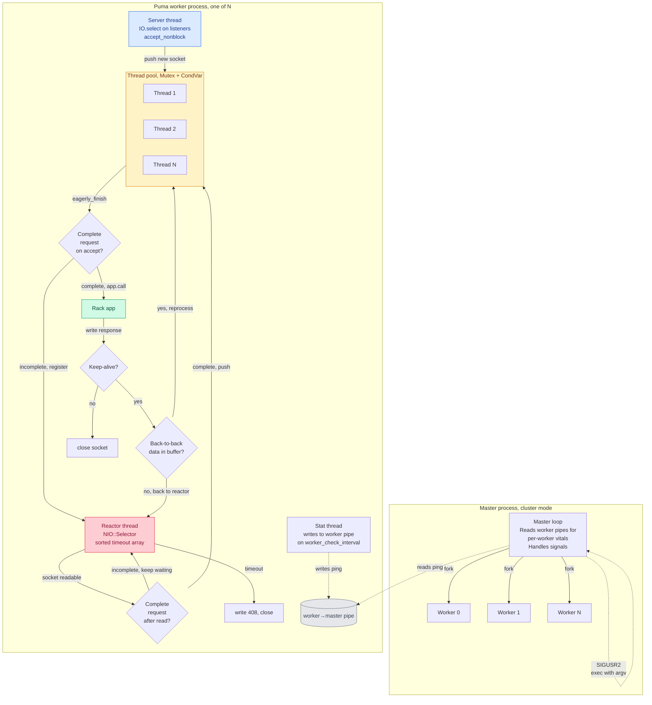
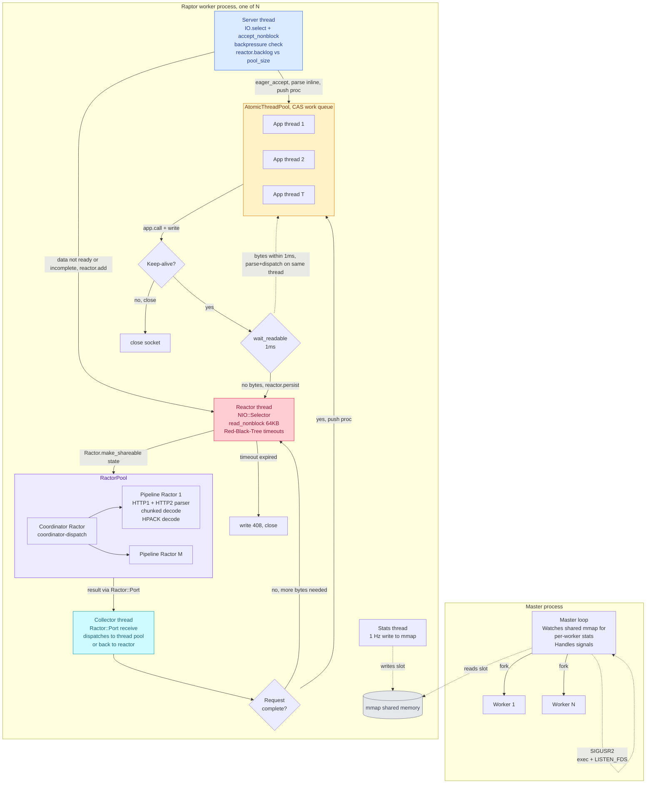
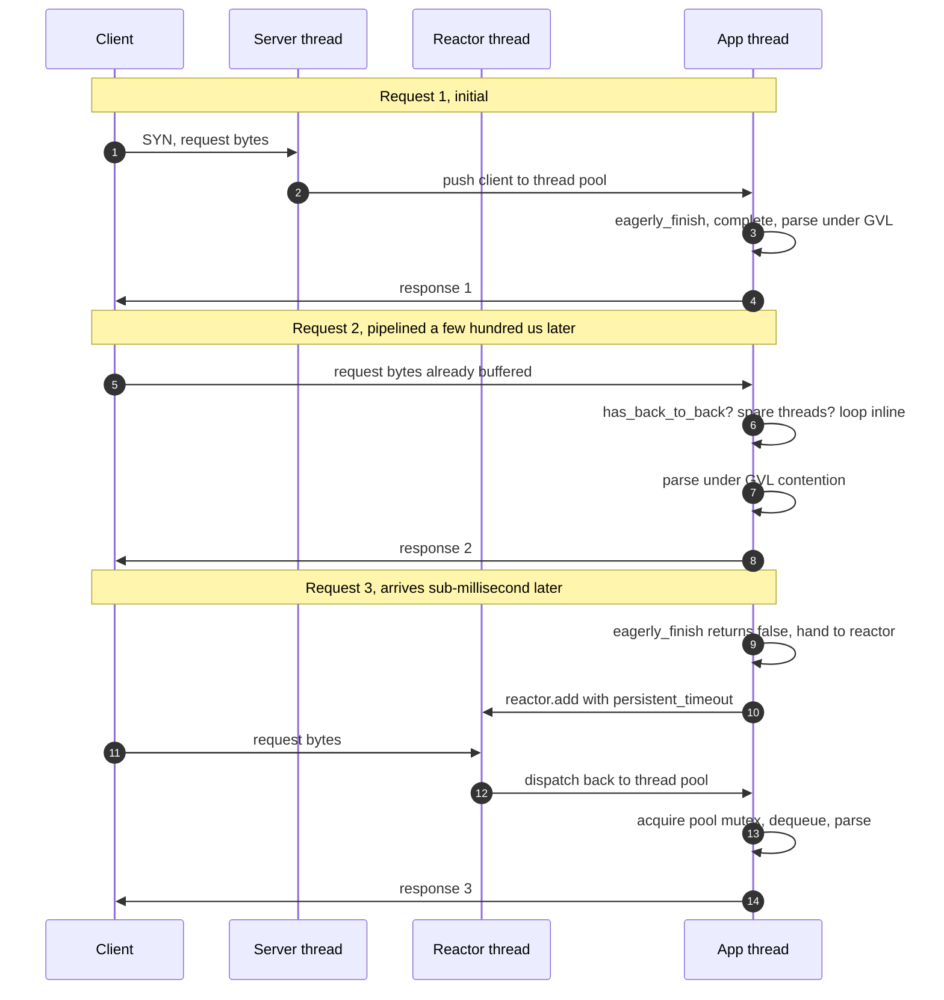
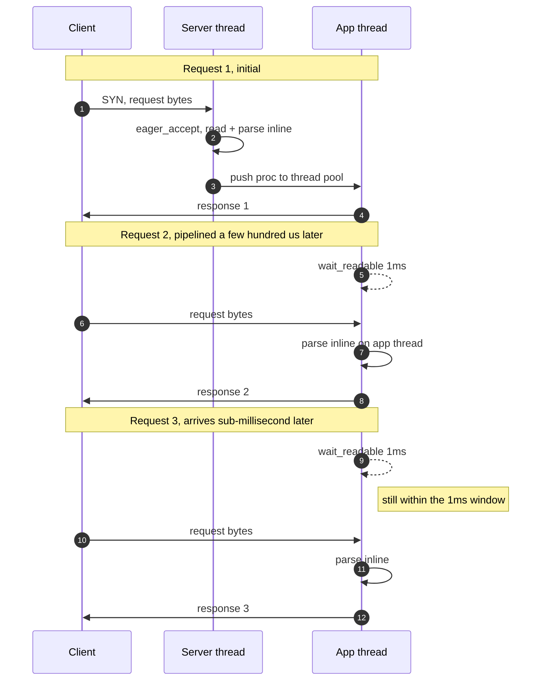

# Raptor vs Puma: A Design Comparison

Raptor is a Ruby web server designed around Ruby 4's Ractors. On CPU-bound HTTP/1.1 with keep-alive it holds a real edge over the latest Puma release on the same hardware; on IO-heavy work fibers still win, and Falcon is the server to compare to there rather than Raptor or Puma. Raptor also speaks HTTP/2 natively, which Puma does not. This document is a systems-design walkthrough of how it manages both.

## Why this document exists

Raptor began as a curiosity project. Ruby 4.0 was landing with a more polished Ractor implementation, and I wanted to see what a web server would look like if you actually leaned into parallel Ruby instead of pretending the GVL was not there. The initial goal was modest: build something that could parse HTTP in parallel using Ractors, hook it up to Rack, and see if the numbers moved.

They did, but the more interesting result was structural. Once you commit to a Ractor-based parser, a whole set of other design choices become almost forced. You need a lock-free work queue to feed the Ractors without recreating a global bottleneck. You need a reactor that can register and deregister thousands of connections cheaply. You need a way to hand a response back to the socket without serialising through a mutex. You need to think about backpressure as a first-class concern instead of a last-minute hack. Each of those decisions individually gives a small edge; stacked on top of each other they produce the gap you see on the benchmark.

This document walks through both servers at systems-design depth. By the end you should be able to describe how Puma and Raptor each move a request from `accept()` to `app.call(env)` and back, why the two architectures make the design decisions they do, and where the performance delta actually comes from. No source code required.

## A note on Falcon

Falcon is the other next-generation Ruby web server worth naming. It takes a different bet than either Puma or Raptor: fiber-based concurrency via the `async` gem instead of threads, native HTTP/2, per-request lightweight tasks instead of a fixed thread pool. Its strengths show up on workloads with lots of concurrent long-lived connections (WebSockets, SSE, streaming), applications built end-to-end on the `async` ecosystem, and HTTP/2-heavy traffic. On a traditional Rails workload where most of the request budget is a synchronous DB round-trip through ActiveRecord, its advantages over Puma are less pronounced because the fiber scheduler only helps when the underlying I/O is fiber-aware. If your app fits that sweet spot, Falcon belongs in your evaluation.

This document focuses on Puma because Puma is the incumbent that any new Ruby web server has to justify itself against; that is the comparison most readers actually need. Falcon appears in the benchmark table in the README as a third data point, but a full design comparison against Falcon would be its own document.

## The shape of the benchmark

Raptor is a research project. It hasn't run production traffic. The numbers in the README come from a repeatable microbenchmark, not from a real deployment. The benchmark measures only the **server** work: accepting connections, parsing, dispatching, and writing responses. It does not measure your application. In a typical Rails app where most of a request's time goes to ActiveRecord and downstream services, the server accounts for maybe 5 to 15 percent of the total, so a +N% number in this table will show up as a much smaller improvement in production. The gap is real, but it isn't what a Rails app against a real database will report.

The Raptor README carries the [current head-to-head numbers](../README.md#micro-benchmarks) against the latest Puma and Falcon releases, run on the same hardware with the same Rack app, 4 workers, 3 threads, 48 concurrent connections, on a recent Ruby with YJIT enabled. Two workload profiles are measured: **IO-bound** (each request does 5 to 10 short sleeps interleaved with small CPU work, simulating a request that makes several DB or cache calls throughout its lifetime) and **CPU-bound** (each request builds a JSON response in 3 to 5 chunks interleaved with sub-100µs sleeps, simulating a request that does most of its work in Ruby with a few near-zero-cost cache hits). The workloads are interleaved rather than a single bulk sleep or single bulk serialise so a fiber-per-connection server like Falcon doesn't look artificially good from one-shot IO. The CPU-bound workload is heavily CPU-dominated by design (roughly 95% CPU / 5% IO by wall time) so it actually measures CPU work rather than smuggling in enough IO for fibers to multiplex. Rather than pin specific numbers into this document (they drift with Ruby versions and hardware), the shape of the result is what matters.

- On IO-bound work, Falcon is roughly 3-4x ahead of both thread-based servers; the fiber-per-connection model can keep every one of the 48 client connections in flight at once, while Raptor and Puma cap out at their 12 threads. Between the two thread-based servers, Raptor holds a modest lead over Puma on throughput and p95.
- On CPU-bound HTTP/1.1 without keep-alive, the three servers land close together on throughput. Raptor's p95 is meaningfully worse than Puma's and Falcon's here; the extra hop through the pipeline shows up as tail latency when connection setup and teardown are also on the critical path.
- On CPU-bound HTTP/1.1 with keep-alive, Raptor pulls ahead of both on throughput and p95. Connection setup is amortised, the eager keep-alive loop keeps requests on the same app thread, and the Ractor-parallel parser earns its cost when many small requests are in flight.
- On HTTP/2, Raptor and Falcon both implement it; Puma doesn't. This matters if you're terminating h2 at the app server, less so if nginx or another proxy in front is already handling it.

The rest of this doc explains why the shape looks like that.

## The two servers at a glance

| Dimension              | Puma                                                    | Raptor                                                                       |
| ---------------------- | ------------------------------------------------------- | ---------------------------------------------------------------------------- |
| Ruby requirement       | 3.0 and up                                              | 4.0 and up (needs `Ractor::Port`)                                          |
| Process model          | Single, or cluster (pre-forks by default with 2+ workers); optional refork | Cluster only, always pre-forks                                               |
| Threading model        | `ThreadPool` with `Mutex` + `ConditionVariable`; autoscaling min/max, or fixed when min == max | Fixed-size `AtomicThreadPool` (CAS-based queue)                              |
| True parallelism       | None inside a worker (GVL); parser runs on the app thread | Ractors parse HTTP in parallel with the app; each Ractor has its own GVL     |
| I/O multiplexing       | `nio4r` reactor for keep-alive idle and slow reads      | `nio4r` reactor for the same, plus a red-black tree for O(log n) timeouts    |
| Reuseport dispatch     | Four-tuple hash (kernel default)                        | Load-aware via an attached BPF program (Linux)                               |
| Work queue             | `Mutex` + `ConditionVariable` + waiter list                 | Lock-free CAS on an `Atom` (Banker's queue)                                  |
| HTTP/2                 | Not implemented                                         | Native C parser + HPACK, lock-free per-connection frame writer               |
| Keep-alive fast path   | Same-thread inline dispatch when spare threads exist    | Same-thread inline plus a `wait_readable(1ms)` micro-poll on the app thread  |
| Native extensions      | 1 (Ragel HTTP/1 parser + MiniSSL)                       | 2, both Ractor-safe (Ragel HTTP/1 parser; HTTP/2 parser + HPACK)             |
| Shared state (worker↔master) | Pipes and signals                                 | Anonymous shared-memory `mmap` region                                        |
| Restart primitives     | Phased (USR1), hot (USR2 re-exec, inherits FDs via env), refork (SIGURG) | Phased (USR1), hot (USR2 re-exec, inherits FDs via env)                    |
| systemd integration    | `sd_notify` via plugin, `LISTEN_FDS` via binder         | Native `sd_notify` + `LISTEN_FDS` socket activation                          |

The rest of the document expands on each row.

## Part I: Puma

### Process model

Puma is bimodal. In single mode the CLI runs a single `Puma::Server` in the current process; in cluster mode the CLI runs a master process that forks N workers, each running its own `Puma::Server`. Cluster mode is the interesting one because it is what almost everyone uses in production, and since Puma 5 it pre-forks by default: with two or more workers, `preload_app` is enabled unless explicitly turned off. The app is loaded once in the master, then N workers are forked from it, which preserves copy-on-write memory. If your app boots threads during load, copy-on-write breaks; every mutation to a page in the child dirties it and forces a private copy. Puma tries to detect this and warns.

Puma also has a `fork_worker` option, which is Puma's answer to CoW decay over time. Worker 0 becomes a "fork server": new workers are spawned from worker 0 rather than from the master, so state built up in worker 0 (JIT caches, initialised gems, warm-up allocations) is shared with siblings via CoW. This is triggered manually with SIGURG or automatically after a request threshold. It is a clever workaround for a real problem, but it also mixes the "master supervises workers" and "worker services requests" concerns.

Workers write their vitals (pid, boot state, timestamp) into a per-worker pipe read by the master. If a worker misses its `worker_check_interval` for longer than `worker_timeout` the master kills it and forks a replacement. Booting workers get a separate `worker_boot_timeout`.

Signals: INT and TERM start a graceful shutdown, USR1 does a phased restart (increment phase counter, replace workers one at a time waiting for each new worker to boot), USR2 does a hot restart (re-exec the master with the same argv), TTIN and TTOU adjust the worker count, HUP reopens logs, and URG triggers a fork-worker refork.

### Threading model

Inside a worker, request work is handled by `Puma::ThreadPool`. The pool has a minimum and maximum thread count, and it autoscales: when work arrives and there are more items queued than there are waiting threads, it spawns a new thread up to the max. The queue is a plain array guarded by a `Mutex`, with a `ConditionVariable` used to park idle threads. Adding work signals the condvar; a waiting thread wakes, dequeues an item, and processes it.

This is a textbook thread pool. It works, and it has for a decade. But it has three characteristics worth noting for the comparison:

1. **Every enqueue and every dequeue takes the mutex.** Under heavy load, the mutex becomes a serialisation point. It is not the dominant cost, but it is a cost.
2. **The autoscaling is not free.** Spawning and reaping OS threads on demand means allocations, thread startup, and reaping accounting that all cost CPU.
3. **`busy_threads`, `waiting`, and `pool_capacity` are computed by reading multiple fields inside the mutex.** Fine, but again: mutex.

The pool exposes `busy_threads`, `waiting`, and `pool_capacity` metrics that the accept loop reads to decide whether to keep accepting or apply back-off. In cluster mode there is also an `accept_loop_delay` that sleeps proportionally to the busy ratio, which prevents a thundering herd where every worker accepts every connection.

### I/O model

Puma has two threads doing I/O per worker: a **server thread** running the accept loop, and a **reactor thread** running `NIO::Selector`.

The server thread is straightforward. It calls `IO.select` on all listener sockets with an `@idle_timeout` (default 30s), then `accept_nonblock` on any that are readable, wraps the resulting socket in a `Puma::Client` object, and pushes the client into the thread pool. That is all it does. Every accepted client is handed off to the thread pool, even if the request would have been readable immediately.

What happens next depends on `queue_requests`. `queue_requests` defaults to true and is the mode almost everyone runs in. When it is true, a thread-pool worker picks up the client and calls `client.eagerly_finish`, which does one non-blocking read attempt and one attempt at parsing. If the request is complete after that single read, the worker proceeds to invoke the Rack app inline. If it is not complete, the worker hands the client to the reactor and returns to the pool. When `queue_requests` is false, the worker skips the eagerly_finish attempt and does a blocking `client.finish(first_data_timeout)`. The `queue_requests: false` path is fine for fast trusted clients but does not scale; a slow client will hold a thread indefinitely.

The reactor is a separate thread running `Puma::Reactor`, which wraps an `NIO::Selector` from nio4r. Its job is to babysit two kinds of sockets:

1. **Sockets in the middle of a request.** A client sent some headers, was not yet complete, and needs more data before the app can be called.
2. **Keep-alive sockets between requests.** The previous request finished, the connection is still alive, and we are waiting for the next request to start.

The reactor stores clients in a data structure keyed by timeout, and every time through the loop it computes the deadline of the earliest-expiring client, calls `selector.select(timeout)`, and then dispatches: any client whose socket is readable calls `try_to_finish`, which does a `read_nonblock` and attempts to parse whatever it got. If the request is now complete, the client is handed to the thread pool. If the socket is not ready or the request is still incomplete, the client goes back to sleep in the reactor.

Puma stores its reactor timeouts in a Ruby array of `Client` objects. New clients are pushed onto the end and the array is re-sorted with `sort_by!(&:timeout_at)` after each batch of inserts. Deletion is a linear scan (`@timeouts.delete client`). That is fine for small numbers of clients but scales linearly in the number of connections. It is not a hot spot at moderate load, but the cost is there.

Cross-thread waking is done through a pipe. When work needs to enter the reactor from another thread (a Client being registered), a byte is written to a pipe that the selector is also watching; the selector wakes, drains the input queue, and gets on with it.

### HTTP/1.1 request lifecycle

Putting the pieces together, a request through Puma looks like this:

1. Server thread `IO.select` returns a readable listener.
2. Server thread `accept_nonblock` produces a new socket. Puma wraps it in a `Client` and pushes it to the thread pool.
3. A thread-pool worker picks up the client and calls `client.eagerly_finish`. This does one `read_nonblock` and one attempt at parsing.
4. If the request is complete after that read, the worker calls `handle_request(client)` inline, which invokes the Rack app, formats the response, writes it back.
5. If the request is not complete, the worker hands the client to the reactor and returns to the pool. The reactor waits for more bytes, retries the parse, and pushes the client back to the thread pool once complete.
6. After the response is written, the client is either closed or, if keep-alive, kept inline on the same thread (if `has_back_to_back_requests?` is true, or `eagerly_finish` on the next request returns true and there is a spare thread), pushed back to the thread pool, or re-added to the reactor with `@persistent_timeout` as the new deadline.

Puma's parser is a Ragel-generated FSM in C. It is invoked from Ruby via `Puma::HttpParser#execute(env, buffer, offset)`. The parser calls back into Ruby via a set of C functions that set entries in the env hash: `REQUEST_METHOD`, `REQUEST_URI`, `PATH_INFO`, `QUERY_STRING`, `SERVER_PROTOCOL`, and one `HTTP_*` entry per header. It also detects the end of headers and reports where the body starts. Everything after that (body reading, chunked decoding, spooling large bodies to Tempfile) is pure Ruby in `Puma::Client`.

Response writing is done from the app thread. Puma sets `TCP_CORK` on Linux, writes the status line and headers, writes the body (chunked, Content-Length, or via `IO.copy_stream` for File bodies to trigger sendfile), unsets `TCP_CORK`, and calls `Rack::BodyProxy#close` and any `rack.after_reply` hooks.

### Puma request flow diagram



Notably, the parser runs inside an app thread. Puma's concurrency model is "many app threads, each doing one full request (parse plus app plus write) at a time". Under MRI's GVL this is genuine concurrency but not parallelism; at any given moment at most one of those threads is executing Ruby, and the others are either blocked on I/O (which releases the GVL and lets another thread proceed) or waiting their turn. Puma leans on the fact that most Rack apps spend most of their time blocked on the database or an external API, where threads do effectively overlap.

## Part II: Raptor

Raptor takes a different position on nearly every axis. It is opinionated in a way that Puma is not, largely because it does not have to support every deployment scenario Puma does.

### Process model

There is no single mode. Raptor is always a cluster: a master forks N workers, monitors them, and restarts crashed workers. The Rack app is always loaded in the master before forking, so copy-on-write is preserved by default (no user-visible `preload_app` knob).

The master is a supervisor. It never handles requests. It forks workers, watches them via a shared-memory region (more on that in a moment), traps signals, restarts crashed workers, and orchestrates restarts.

Two kinds of restart are supported:

1. **Phased restart on SIGUSR1.** Same idea as Puma: kill each worker in sequence, wait for its replacement to boot, move on. Existing workers drain their connections while their replacements come up. This is cheap and safe when the change does not require a fresh master.

2. **Hot restart on SIGUSR2.** Also known as "zero-downtime restart with FD inheritance". The master clears the close-on-exec flag on every listener, JSON-encodes the map from bind URI to file descriptor into an environment variable (`RAPTOR_INHERITED_FDS`), and re-execs itself with the original command line. The new master reads the environment variable and rebuilds its `Binder` from the inherited FDs instead of binding fresh sockets. Not a single connection is dropped, and the new master runs its initialisation from scratch (loading a newer Rack app, applying new config, whatever).

Systemd socket activation is a native feature and slots straight into this model. When the service unit is `Type=notify` and there is a socket unit, systemd passes listener FDs via `LISTEN_FDS`. Raptor detects this exactly the same way it detects a hot restart handoff: `Systemd.listen_fds` returns the FDs, the binder is built from them, and the master sends `READY=1` back to systemd once workers have booted. `STOPPING=1` and `RELOADING=1` fire on the corresponding lifecycle events.

Master-to-worker communication does not use pipes. Every worker writes its stats (pid, request count, backlog, busy threads, last checkin timestamp, booted flag) into a fixed-size slot in an anonymous shared-memory region allocated with `mmap-ruby` before the fork. The master reads the region directly. There is no serialisation, no pipe drain, no signal to trigger the read; it is 49 bytes per worker of native memory. `bundle exec raptor stats` prints the region as JSON.

On Linux, each worker pins itself to a distinct CPU via `sched_setaffinity` when the worker count fits within the process's allowed CPU set, so it stays on one core and its L1/L2 caches stay warm. When workers outnumber available CPUs the pin is skipped and the kernel scheduler manages placement.

### Threading model

This is where Raptor diverges dramatically. Inside a worker there are five kinds of concurrent activity:

1. **One server thread** running the accept loop.
2. **One reactor thread** running the NIO event loop plus timeout tree.
3. **A `RactorPool` of M pipeline Ractors** doing HTTP parsing in parallel. Default M is 1, but the interesting part is that this can be scaled up.
4. **A collector thread** that receives parsed results from the pipeline Ractors via a `Ractor::Port`.
5. **An `AtomicThreadPool` of T app threads** running the Rack app and writing responses.
6. Plus one stats thread that writes the shared-memory slot every second.

That is a lot of moving parts. Let us go through why.

**Why Ractors for parsing.** Ractors are Ruby's answer to true parallelism. Multiple Ractors can execute Ruby code simultaneously on different OS threads, each with its own GVL. But Ractors are heavily restricted. They can only share frozen data, they cannot access most global mutable state, and code inside a Ractor cannot use most existing gems (which universally assume shared-state semantics).

For a web server, this restriction turns out to be almost exactly right for HTTP parsing. Parsing a request is CPU-bound (tokenising bytes, uppercasing header names, decoding chunked bodies), it does not need to touch any global state, and it produces a result (a hash) that can be safely frozen and handed off. The native HTTP/1 parser (`raptor_http.c`) is declared `rb_ext_ractor_safe(true)`: it holds no per-parser Ruby state in the extension itself, and it writes only into the caller-supplied env hash. Same for the HTTP/2 parser plus HPACK.

The HTTP/1 parser also pre-interns the ~40 most common header keys (`HTTP_HOST`, `HTTP_USER_AGENT`, the `HTTP_ACCEPT_*` family, `CONTENT_LENGTH`, `HTTP_X_FORWARDED_*`, the `HTTP_SEC_FETCH_*` client hints, and so on) once at load time. During parsing, a `memcmp` lookup against that table returns the shared frozen `VALUE` for known keys and falls back to `rb_enc_interned_str` for the rest. Every request's env hash therefore reuses the same String object for its header names, which both skips per-request allocation and lets Ruby's hash lookup use the interned key's cached hash code.

The upshot is that while your Rack app runs on regular threads under the GVL (so your app does not need to be Ractor-safe), the protocol-level work runs in parallel across Ractors. Under heavy load with lots of small requests, the GVL contention that would otherwise dominate parsing simply is not there.

**How the Ractor pool actually works.** Raptor uses the `ractor-pool` gem, which is another one of my libraries. The pool has one coordinator Ractor and M pipeline Ractors. When a pipeline Ractor is idle, it sends itself back to the coordinator via `coordinator.send(Ractor.current, move: true)`. When work arrives at the coordinator, it either forwards it to a waiting Ractor (if any) or queues it. This coordinator-dispatch pattern guarantees that no Ractor sits idle while there is work. Results flow back through a shared `Ractor::Port` (a many-to-one channel added in recent Ruby versions and stable in 4.0) to a Ruby-side collector thread. If `M == 1` the coordinator is skipped and work goes straight to the single pipeline Ractor; this is the default because a single Ractor already parses in parallel with the app threads and adds enough headroom for typical workloads.

Note that Ractors also have their own copy of the code, so booting them means loading dependencies inside each Ractor context. Raptor pre-loads only what the parser needs.

**Why a custom thread pool.** The `AtomicThreadPool` in `atomic-ruby` (another one of my libraries) is a fixed-size pool where the work queue is stored as a frozen `{in:, out:, count:, shutdown:}` hash inside an `Atom` (a CAS-protected reference cell). Enqueuing is one CAS: the new work item is prepended to the `in` stack. Dequeuing is one CAS: pop from `out`, or if `out` is empty, atomically flip `in` and `out` (this is the "Banker's queue" pattern). Backpressure metrics (`queue_length`, `active_count`) are single reads of the atomic state, no lock required.

The pool still uses an `AtomicConditionVariable` under the hood to park idle threads (idle threads call `Thread.stop` and get woken with `Thread#wakeup`; there is no spinning), because idle spinning would waste CPU. The difference from Puma's pool is not "no locks anywhere" but rather "the hot path (enqueue and dequeue when the queue has items) is lock-free". Once every worker is busy the mechanics look similar; where things diverge is under contention when you have many threads all trying to push and pop.

The knock-on effect is that reading pool state to make backpressure decisions is essentially free. The server thread can read `pool.queue_size + pool.active_count` every iteration of the accept loop without introducing a synchronisation point.

### I/O model

The server accept loop is an `IO.select` + `accept_nonblock` loop, similar to Puma. What is different is the check right before `accept`:

```ruby
backpressure_threshold = [(@thread_pool.size * 1.2).ceil, MIN_BACKPRESSURE_THRESHOLD].max
# ...
next if @reactor.backlog >= backpressure_threshold
```

where `@reactor.backlog` is `thread_pool.queue_size + thread_pool.active_count`. If the total load on the thread pool is at 120% of the pool size, this worker stops accepting until it drains. `MIN_BACKPRESSURE_THRESHOLD` is 8, so small pools (say, 3 threads) trip backpressure at 8 concurrent items rather than at 120% of a very small number; the floor keeps saturated workers signaling early so the load-aware dispatcher (below) has time to route around them.

Because Raptor is always in cluster mode and every worker listens in the same `SO_REUSEPORT` group, load balancing across workers happens at the kernel level. On Linux, Raptor attaches a small BPF program to the reuseport group. Each worker binds its own listener registered in a sockmap, and a dedicated reporter thread publishes the worker's current reactor backlog into a loads map at 100 Hz. The BPF program consults the map on every incoming connection and routes it to the least-loaded worker, with a random tie-break when loads are equal. If the `libbpf-ruby` gem is not installed or the BPF object has not been compiled, Raptor falls back silently to the default four-tuple-hash routing; if the kernel refuses the program, startup raises. Either way, if a worker is saturated and stops calling `accept`, other workers pick up the slack.

The reactor is again an NIO::Selector loop. Two things make it different from Puma's:

1. **Read strategy.** When a socket is readable, the reactor does one `read_nonblock(64KB)` right there in the reactor thread, updates the buffered state for that connection, and only then decides what to do. If the request is not yet complete, the state stays in the reactor and awaits more data. If it is complete (headers parsed, body received), the state is pushed to the Ractor pool for parsing (or, for HTTP/2, straight to the parser). The reactor does not try to parse; it does the I/O and hands off the raw buffer.

2. **Timeout data structure.** Instead of a sorted linked list, timeouts are stored in a red-black tree (`red-black-tree` gem, yes, also one of mine). Each connection is represented by a `TimeoutClient < RedBlackTree::Node` ordered by its `timeout_at` value. Insertion is O(log n), deletion by key (needed when a connection's timeout is updated mid-flight, which happens on every read) is O(log n), and in-order traversal is O(k) where k is the number of expired connections. After every selector poll, the reactor walks the tree in order and breaks on the first non-expired node.

Why a tree instead of a heap? A min-heap gives you O(1) peek and O(log n) insertion, but deleting an arbitrary node (or updating one) is O(n) because you have to find the node first. Since every read on a connection resets its timeout deadline, and every response completion removes a connection from the reactor, you get a lot of "update this specific node" and "remove this specific node" operations. The tree makes those O(log n). It is a small thing, but the reactor manages hundreds to thousands of connections in a busy worker, and the difference between O(log n) and O(n) matters at that scale.

Three timeout classes are tracked:

- `first_data_timeout` (30s): applied to a fresh connection with no bytes read yet.
- `chunk_data_timeout` (10s): applied once data has started arriving but the request is incomplete.
- `persistent_data_timeout` (65s): applied to a keep-alive socket sitting idle between requests.

On timeout, the reactor writes `HTTP/1.1 408 Request Timeout` and closes.

### HTTP/1.1 request lifecycle

An HTTP/1.1 request takes one of two paths. The **fast path** fires when the first `read_nonblock` on the accepted socket produces the complete request. `eager_accept` on the server thread reads, parses the request inline, and pushes it straight to the thread pool, bypassing both the reactor and the Ractor pool. An app thread then builds the Rack env, calls the app, and writes the response.

The **pipeline path** fires when the first read returns `WaitReadable` (bytes have not arrived yet) or leaves the request incomplete. It goes:

1. `eager_accept` calls `@reactor.add(state)` with the socket, an empty buffer, and metadata (remote address, URL scheme).
2. Reactor thread registers the socket with the NIO selector and adds a `TimeoutClient` node to the RBT with `first_data_timeout`.
3. Bytes arrive. Selector wakes. Reactor calls `read_nonblock(64KB)`, appends to the state's buffer.
4. Reactor calls `Ractor.make_shareable(state)` and pushes the state onto the Ractor pool via `ractor_pool << shareable_state`.
5. Pipeline Ractor parses the buffer using the C extension. If the request has a chunked body, chunk decoding runs inline in the pipeline Ractor as a pure function. The parser returns a result including whether the request is complete.
6. Result travels through `Ractor::Port` to the collector thread.
7. Collector thread receives the parsed result. If incomplete, state goes back into the reactor to await more data. If complete, the socket is deregistered from the reactor and a proc is pushed to the `AtomicThreadPool`.
8. An app thread pops the proc, builds a Rack env, calls `@app.call(env)`, and writes the response.
9. If the response signals keep-alive (HTTP/1.1 default without `Connection: close`), the app thread enters the **eager keep-alive loop**.

That eager keep-alive loop is the biggest single contributor to Raptor's keep-alive edge. Rather than immediately returning the connection to the reactor after a response, the app thread does:

```ruby
loop do
  unless socket.wait_readable(KEEPALIVE_READ_TIMEOUT) # 0.001 s
    reactor.persist(socket, id, request_count, ...)
    return
  end
  # There are bytes. Try to parse the next request inline.
  ...
end
```

The thread waits 1 millisecond for the next request. If bytes arrive in that window, it parses them inline on the same thread and calls the Rack app again. It only goes back to the reactor once the client actually stops sending. This is essentially free for pipelined clients (they get zero reactor round-trip on subsequent requests) and cheap for slow clients (a 1ms `wait_readable` is nothing).

Puma has a similar shape but it is triggered differently: Puma checks `client.has_back_to_back_requests?` (are there already bytes in the buffer) and, only if that is true and there are spare threads, processes inline. If the client has already sent the next request while the response was being written, Puma catches it; if the client sends it 500 microseconds after the response, Puma bounces it through the reactor. Raptor's 1ms wait catches both cases.

The `reactor.persist` call re-registers the socket with the reactor using `persistent_data_timeout` (65s) as the new deadline. When the next bytes arrive, the reactor treats the socket like any other partially-read connection.

### HTTP/2 request lifecycle

Raptor speaks HTTP/2 on TLS connections where the client negotiates it via ALPN. The binder sets `alpn_protocols = ["h2", "http/1.1"]` on the SSL context and the ALPN callback picks h2 whenever the client offers it. Puma does not do this. Puma's SSL context does not advertise `h2` in ALPN, so clients transparently fall back to HTTP/1.1.

Once ALPN selects h2, the initial `SETTINGS` frame is written and the socket is registered in the reactor with `protocol: :http2` plus a fresh `Writer` and `FlowControl` for the connection.

From there the shape is similar to HTTP/1.1:

1. Reactor reads frames.
2. The HTTP/2 parser (native C, with an HPACK decoder using a static Huffman table) parses the frames in the Ractor pool.
3. Completed requests (once HEADERS+DATA is complete for a stream) go to the thread pool as separate work items. **A single connection can be servicing many streams in parallel across the thread pool.**
4. Each stream's response is written back through the connection's `Writer`, which serialises frame writes across threads without a mutex.

The Writer is worth a paragraph. Naive per-connection writing would use a mutex: acquire, write, release. Contention grows with concurrent streams. Raptor's Writer stores the "pending frames" queue in an `Atom` whose value is either `:idle` (nobody is writing) or an array of frames waiting to go out. A thread that wants to write does a CAS:

- If current value is `:idle`, the thread claims the writer by CAS-ing to its own array of frames, then loops draining any additional frames other threads have appended.
- If current value is an array (someone is already writing), the thread CAS-appends its frames and returns immediately; the current writer will pick them up and flush them.

So under contention, only one thread does socket I/O at a time (because a socket can only be written to serially anyway), but no thread ever blocks on a lock. The "loser" of the CAS hands its frames off to the "winner" and returns immediately to whatever it was doing next, whether that is starting another stream, waiting for the next work item, or servicing a different connection.

Flow control uses similar CAS-protected atoms. The connection-level window and the per-stream windows live in separate `Atom` cells so the common case (connection window has capacity) doesn't require per-stream book-keeping. `acquire` on the `FlowControl` atomically deducts from the connection window; if that succeeds it also deducts from the stream window. If either window is exhausted, the caller sleeps 1ms and retries. Under real traffic this practically never happens because the peer's window is refilled proactively via `WINDOW_UPDATE` frames as we drain the client's buffered body bytes.

Frame processing also has an eager loop. After processing one batch of frames, the h2 handler tries to `read_nonblock` one more time to see if the next batch is already available. Up to four rounds are consumed inline before handing back to the reactor. This is the same principle as the HTTP/1.1 eager keep-alive: amortise the reactor round-trip when the client is actively sending.

### Raptor request flow diagram



The critical structural difference from Puma is that parsing is not on the app thread. It is on the Ractor pool. The app thread only does the Rack call and the response write. This decouples the two costs and lets Ruby actually use more than one CPU for the protocol work.

## Part III: Head to head

### Parsing model

**Puma.** Parsing happens on the app thread. The C parser callbacks build the env hash. Between requests, the thread either loops (if there's back-to-back data and a spare thread) or hands off to the reactor. Every request goes through: reactor → thread pool → parser (Ruby thread + C ext) → app → write → reactor. Parsing shares the GVL with the app.

**Raptor.** Parsing happens on Ractors. Between requests, the app thread does a 1ms micro-poll before handing back. Every request goes through: reactor (I/O only) → Ractor pool (parse only) → collector → thread pool (app + write) → 1ms wait → maybe repeat. Parsing does not share the GVL with the app because Ractors have their own GVLs.

Concrete effect: Puma has one process-wide GVL. Every thread inside a worker (server, reactor, and every app thread) has to take turns holding it. Raptor has that same main-process GVL plus one additional GVL per Ractor. With 3 app threads and 1 pipeline Ractor, Raptor can genuinely run two things at the same time on two CPU cores: the Ractor parsing an incoming request, and an app thread executing the Rack app. Puma cannot. Under CPU-heavy parsing (many small requests, high header count), Raptor's parsing throughput is straightforwardly higher because the parse never contends with the app for the same GVL.

### Timeout management

**Puma.** Ruby array re-sorted with `sort_by!` after each batch of inserts. Sort is O(n log n). Remove is a linear scan, O(n). Fine at small scale.

**Raptor.** Red-black tree keyed by `timeout_at`. Insert O(log n), remove O(log n), in-order traversal breaks early on first non-expired node. Scales cleanly to thousands of connections.

At a moderate 100 concurrent connections this is a rounding error. At 1000+ (which happens with keep-alive) the difference in per-cycle overhead becomes visible.

### Work queue

**Puma.** Standard `Mutex` + `ConditionVariable` + Array-as-queue. Every enqueue takes the mutex, wakes a waiter. Every dequeue takes the mutex to check the queue. Under contention, the mutex is a serialisation point.

**Raptor.** CAS on an Atom holding a frozen `{in:, out:, count:}` hash (Banker's queue). Enqueue is a single CAS to prepend to the in-stack. Dequeue is a single CAS to pop from the out-stack (or, if empty, atomically flip in/out). Metrics (queue length, active count) are lock-free reads.

The condvar is still there for parking idle threads (spinning would burn CPU), but the hot path when the queue has items is lock-free.

Under moderate load these look equivalent. Under high concurrency (many threads racing on the queue), Raptor's queue has significantly lower contention overhead. The queue length being lock-free also makes the server's per-cycle backpressure check essentially free, whereas Puma has to grab the mutex or use approximate stats.

### Keep-alive fast path

**Puma.** After a response, if the connection is keep-alive and there are already buffered bytes for the next request (`has_back_to_back_requests?`) and there is a spare app thread, loop inline. Otherwise, if `eagerly_finish` (a single non-blocking read attempt) returns true, either loop inline (if spare threads) or hand back to the thread pool (`@thread_pool << client`). Otherwise, back to the reactor with `@persistent_timeout`.

**Raptor.** After a response, the app thread does `socket.wait_readable(0.001)`, waiting up to 1ms for bytes. If bytes arrive, it parses the next request inline. If the thread pool queue is at least as deep as the pool, the parsed request is handed back to the pool so other threads share the load; otherwise the same thread dispatches it inline. If no bytes arrive, `reactor.persist` and return.

The difference is subtle but the numbers show it up. Real-world clients pipelining requests often send the next request 100-500 microseconds after the previous response completes. Puma's `eagerly_finish` catches the case where bytes are already in the socket buffer; Raptor's `wait_readable(1ms)` catches both the "already buffered" case and the "arriving very shortly" case. And Raptor always parses the next request on the response-writing thread, so the parse itself never crosses a thread boundary.

This is where most of Raptor's keep-alive edge comes from. Subsequent requests are always parsed and dispatched without a reactor round-trip: the response-writing thread either continues serving that connection inline (when the pool queue is shallower than the pool) or hands the parsed request back to the pool for another thread to pick up (when it is not). Puma's app threads do the same when they can, but the coordination overhead between thread pool and reactor for the transitions costs meaningfully more.

### Backpressure

**Puma.** Cluster mode uses `accept_loop_delay` (sleep proportional to busy ratio) to prevent thundering herd across workers. Single-worker backpressure is implicit: if all threads are busy and the queue is growing, new accepts pile up in the kernel accept queue. Puma does have `queue_requests` (default true) which pushes partial requests into the reactor, freeing the accept loop, but there is no explicit "stop accepting" signal from the worker.

**Raptor.** Explicit backpressure formula, read every iteration of the accept loop: `if backlog >= max(pool_size * 1.2, 8), skip accept`. When a worker is saturated, other workers pick up the traffic. On Linux, an eBPF program attached to the reuseport group actively routes new connections to the least-loaded worker (see the I/O model section); elsewhere Raptor relies on the kernel's default four-tuple-hash routing.

### Shared state (worker ↔ master)

**Puma.** Pipes. Each worker writes ping messages to a pipe read by the master. Signals push the master to check status. Simple, works everywhere, but every stat update involves a syscall on both ends.

**Raptor.** Anonymous mmap region shared across workers via `mmap-ruby`. Each worker writes a 49-byte slot for its own vitals every second. The master reads the region directly. No syscalls in the hot path.

The performance difference here is negligible. Stats writing is one syscall per worker per second in either case, and it does not affect request processing throughput. But it does make `bundle exec raptor stats` faster than Puma's control endpoint, and it means the master never blocks reading pipe data even if a worker is misbehaving.

### HTTP/2

**Puma.** Not implemented. Puma's [position](https://github.com/puma/puma/issues/2697) is that HTTP/2 belongs at the edge (nginx, Caddy, ALB), which terminates it and speaks HTTP/1.1 to the app server. That's a reasonable call for the deployments Puma is aimed at, and it's where most Rails production actually sits.

**Raptor.** Native C parser plus HPACK, per-stream flow control, lock-free frame writer, stream multiplexing over a single connection. Same request path as HTTP/1.1 once a request is complete: it enters the same thread pool. Under HTTP/2, a single client connection can be issuing many concurrent requests, and Raptor services all of them in parallel on the same thread pool.

Whether that matters depends on your setup. If you terminate TLS at an edge proxy that already speaks HTTP/2, both servers see HTTP/1.1 and it doesn't matter which of them you pick on this axis. If you're building an all-Ruby stack with no proxy in front, running gRPC or similar all the way through, or measuring the app server itself, HTTP/2 support is where Raptor and Puma stop being comparable.

At the throughput numbers the benchmark shows, with only a handful of concurrent connections each multiplexing many streams, Raptor is exercising the HTTP/2 multiplexing hard: many in-flight streams sharing one socket, all writing responses through the same connection. The writer's CAS-based coordination avoids the mutex contention that would otherwise cap throughput.

### Response writing

Both servers do the same fundamental things: `TCP_CORK` on Linux to batch small responses, `IO.copy_stream` for File bodies (which invokes the sendfile syscall on Linux), non-blocking writes with `wait_writable(timeout)` on EAGAIN, chunked transfer encoding for enumerable bodies without a known length.

On the HTTP/1.1 path, Raptor has a small `writev(2)` C extension (`Raptor::VectorIO`) that scatter-writes the status line, headers, and body in a single syscall for non-chunked responses. Puma sends the same content over multiple `write` calls batched by `TCP_CORK` at the kernel; Raptor collapses that to one syscall in userspace. The saving is a few microseconds per response, but it stacks on top of every h1 response.

HTTP/1.1 responses also reuse a per-thread String buffer for the status line and headers rather than allocating one per response. The buffer grows once to fit the largest response the thread has served and stays that size afterwards, so subsequent responses on that thread skip the allocation entirely.

Chunked responses with an array or file body accumulate chunk-framed writes into the response buffer up to 512KB before flushing to the socket, collapsing what would be N `write` syscalls for an N-chunk body into a handful. Enumerable bodies (SSE, long-polling, per-line log tailing) still flush every chunk, so streaming semantics are preserved.

Around the response boundary, HTTP/1.1 also amortises the common per-request allocations. A frozen Rack env template with the static keys (`rack.version`, `rack.hijack?`, `SCRIPT_NAME`, `QUERY_STRING`, `SERVER_SOFTWARE`) is duped per request, so the app-thread env build only writes the dynamic keys. Response header serialisation appends directly onto the response buffer instead of allocating intermediate `Array` wraps and `flat_map` products for each header value.

### Keep-alive request by request

Because the keep-alive fast path is where Raptor's throughput edge shows up, here is each server processing three back-to-back requests on the same connection. Drawn separately so the participant columns stay wide enough to read. Compare the number of boundaries each request has to cross.

**Puma, three keep-alive requests:**



**Raptor, three keep-alive requests:**



Puma has to bounce Request 3 through the reactor and back through the mutex-protected thread pool. Raptor's 1ms window catches it and processes it on the same thread. Over thousands of requests per second per connection, those bounces add up.

## Part IV: What Raptor's design buys you

### IO-bound work, where Falcon wins and Raptor edges Puma

On the IO-bound benchmark profile, each request does 5 to 10 short sleeps interleaved with small CPU work, simulating a request that makes several DB or cache calls throughout its lifetime. The bottleneck is how many requests a worker can keep in flight while they wait on IO. Raptor and Puma cap out at their 12 total threads (4 workers × 3), so with 48 client connections the extra 36 sit in the pool queue at any given moment. Falcon spawns a fiber per connection and cooperatively yields on every sleep, so all 48 requests can be in flight simultaneously. That gap shows up as roughly 3-4x throughput and much lower p95 for Falcon.

Between the thread-based servers, Raptor holds a modest lead over Puma. The eager accept path, writev-batched responses, and lock-free work queue all shave a bit of per-request time, and those savings stack.

Real applications that spend most of their time waiting on a database or an upstream service look like this. If your app is IO-heavy and you're free to adopt the `async` ecosystem, Falcon is the interesting comparison there, not Raptor or Puma.

### CPU-bound HTTP/1.1, where the pool model earns its keep

On the CPU-bound benchmark profile, each request builds a JSON response in 3 to 5 chunks totalling 450 to 1500 items, with sub-100µs sleeps between chunks. It's roughly 95% CPU by wall time, so fibers can't multiplex their way to an advantage. The CPU work happens under a single Ruby VM regardless of concurrency model.

**Without keep-alive**, every request opens a fresh TCP connection, gets parsed, dispatched, served, and closes. All three servers land within a few percent of each other on throughput. Raptor's p95 is meaningfully worse than Puma's and Falcon's here; the extra hop through the Ractor pipeline shows up as tail latency when connection setup and teardown are also on the critical path.

**With keep-alive**, Raptor pulls ahead of both Puma and Falcon on throughput and p95. Connection setup is amortised, the eager keep-alive loop keeps subsequent requests on the same app thread, and the Ractor-parallel parser earns its cost when many small requests are in flight. This is the shape of workload Raptor's design was optimised for.

### HTTP/2, when it matters

Puma doesn't implement HTTP/2, and most Rails production terminates HTTP/2 at nginx or a similar edge proxy before it reaches the app server. If that describes your stack, Raptor's HTTP/2 support isn't going to help you. Both servers see HTTP/1.1 from the proxy and the throughput numbers above are what actually matter. Puma's [position](https://github.com/puma/puma/issues/2697) is that this is where h2 belongs, and it's a reasonable one.

Where Raptor's HTTP/2 support does matter is the all-Ruby stack. No proxy in front, TLS terminated at the app, clients speaking h2 all the way through (`curl --http2`, gRPC-Ruby transports, HTTP/2-only SDKs, direct browser connections). In that setup, Puma silently falls back to HTTP/1.1 and you lose multiplexing, header compression, and prioritisation.

Beyond that binary, Raptor's HTTP/2 CPU-bound throughput in the benchmark is on the same order as its HTTP/1.1 keep-alive throughput on the same profile, despite each connection multiplexing dozens of concurrent streams into a single socket. That only happens if the per-stream coordination is essentially free. The lock-free `Writer` and flow-control atoms are doing real work here. If they used mutexes, throughput would be capped by lock contention rather than by CPU.

## Part V: What Raptor gives up

No design comes free. Two disclosures matter most.

**Battle-tested.** Puma has been running production Rails apps since 2011. Raptor has been running my benchmarks since 2026. Those are not the same thing. Raptor is still young code. If your risk tolerance requires a decade of production hardening baked into the server itself, Puma is the answer today.

**Ruby version.** Raptor requires Ruby 4.0 because it depends on `Ractor::Port` and on Ractor internals having stabilised. Puma works on 3.0 and up. If you need to support older Ruby, Puma wins by default.

A handful of smaller trade-offs are worth naming briefly. Raptor pays some minimum-latency overhead per request because of the Ractor crossing, so at extremely low concurrency Puma's simpler flow can edge ahead; the eager-parse path on the server thread hides most of this in practice. Raptor's core dependencies (`ractor-pool`, `atomic-ruby`, `red-black-tree`, `mmap-ruby`, `libbpf-ruby`) are libraries I wrote specifically to make it work, which is either "purpose-built" or "narrower testing surface" depending on how you look at it. Debugging is harder because control flow crosses Ractor and thread boundaries, so tracing a request end-to-end means stitching several stack traces together. Raptor has no single-process mode; on a single-CPU container it wastes a small amount of coordination overhead. And Puma's `fork_worker: true` refork mode is a genuinely clever answer to CoW decay over time that Raptor has no equivalent for.

## Part VI: The design in one line each

If you had to compress this whole document into a handful of one-line framings, these are the ones that carry the most:

- **"Puma centres on the thread pool. Raptor centres on the pipeline."** In Puma, a request lives on a single thread from parse through response write, and the reactor exists to feed the pool. In Raptor, each stage runs on its own primitive (accept loop, reactor, Ractor pool, thread pool) and the handoff between stages is the design's core concern.

- **"The GVL is not the enemy. Serialising parsing behind the GVL is the enemy."** Ruby threads are fine for I/O-bound work; the app thread spends most of its time waiting on the database. What you cannot afford is spending CPU cycles under the GVL doing work that does not need the GVL, like tokenising HTTP headers.

- **"Ractors are impractical for user code but perfect for protocol code."** The very things that make Ractors annoying for application code (frozen data only, no shared mutable state) are exactly what you want in a parser: a pure function from bytes to headers with no side effects.

- **"Lock-free is not always faster, but it is always less variable."** A CAS-based queue does not out-perform a mutex in every scenario, but its worst-case latency is much better. Under contention, mutex-based code can suffer thundering herd wakeups and cache-line bouncing that a CAS design avoids.

- **"The keep-alive edge is not one big win, it is many small wins that stack."** Eager keep-alive, RBT timeouts, CAS work queue, Ractor parsing, lock-free backpressure. Each adds a few percent and stacked they produce a measurable lead.

- **"HTTP/2 is not a nice-to-have; it changes the arithmetic."** With HTTP/2, one client connection can be doing dozens of requests concurrently. Suddenly every serialisation point in the server becomes a bottleneck. The lock-free primitives Raptor uses for HTTP/1.1 are not optional for HTTP/2; they are structural.

- **"This is what Ruby 4 lets you do."** `Ractor::Port`, `Ractor.shareable_proc`, `rb_ext_ractor_safe`, native-extension Ractor safety. These are all recent additions. Raptor is essentially a demo of what becomes practical when you have them.
