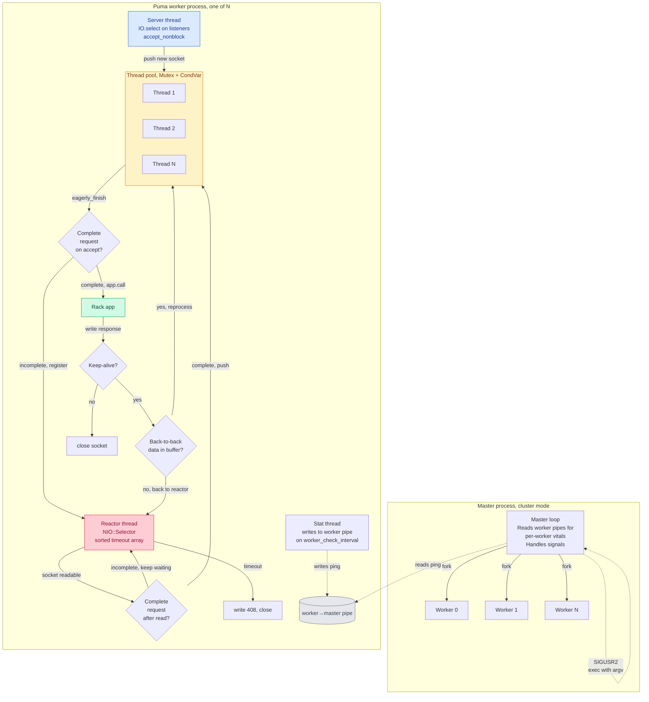
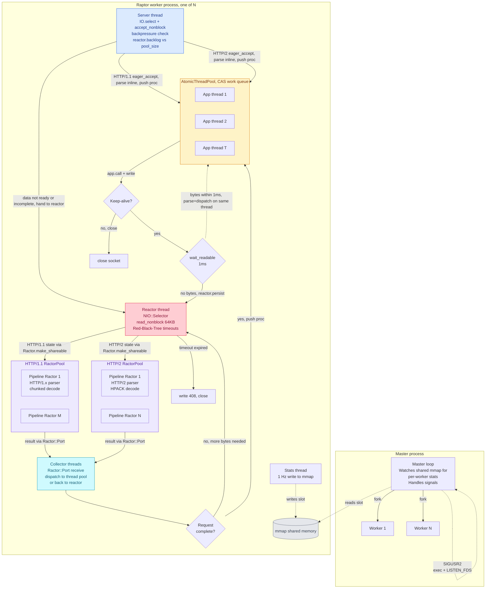
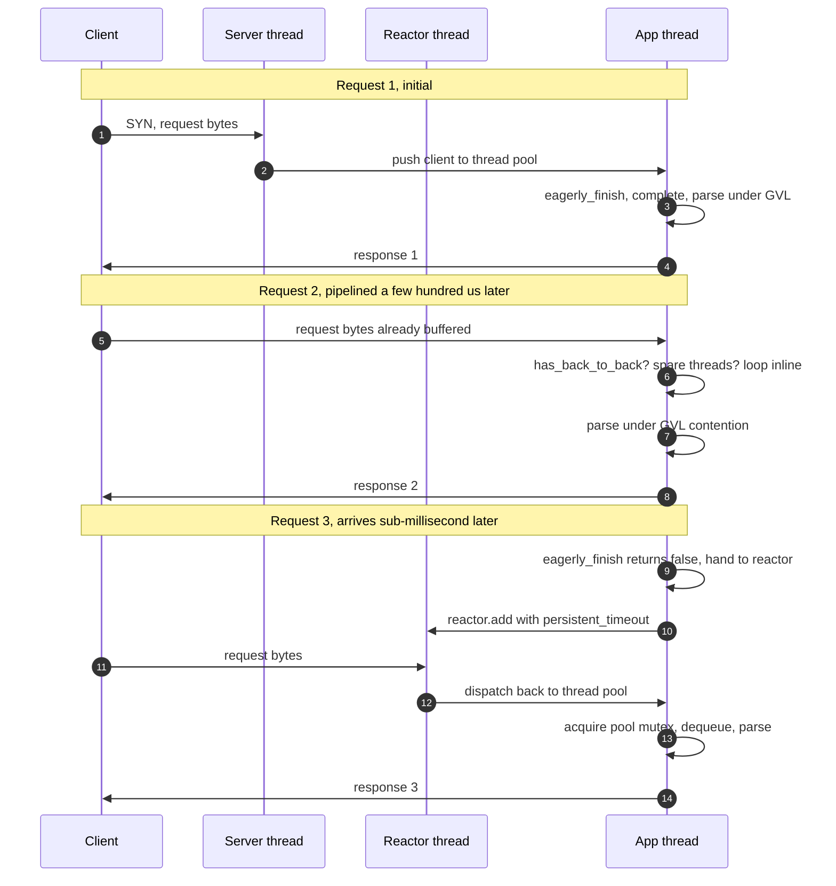
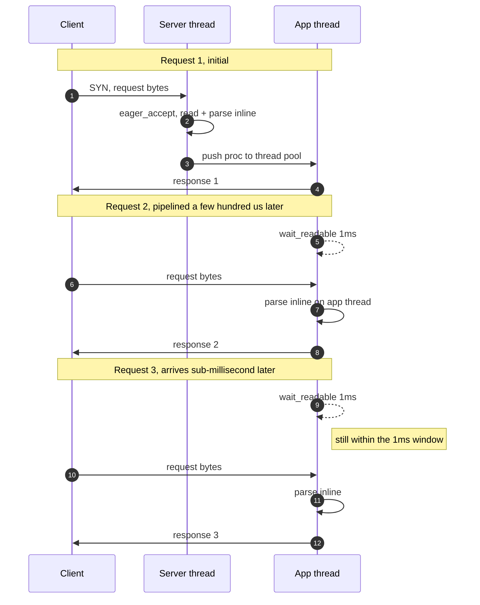

# Raptor vs Puma: A Design Comparison

Raptor is a Ruby web server built around Ractor-parallel protocol pipelines, a lock-free app thread pool, and an opinionated cluster architecture. Against the latest Puma release on the same hardware, it leads clearly on the IO-heavy HTTP/1.1 benchmark and lands within a few percent on CPU-heavy throughput, while Falcon's fibers remain the strongest fit for highly concurrent IO. Raptor also speaks HTTP/2 natively, which Puma does not. This document explains how those designs move requests and where each trade-off shows up.

## Why this document exists

Raptor began as a curiosity project. Ruby 4.0 was landing with a more polished Ractor implementation, and I wanted to see what a web server would look like if you actually leaned into parallel Ruby instead of pretending the GVL was not there. The initial goal was modest. Build something that could parse HTTP in parallel using Ractors, hook it up to Rack, and see if the numbers moved.

They did, but the more interesting result was structural. Committing to Ractor-based protocol pipelines made every boundary around them visible: which requests are worth sending through a Ractor, how partial requests return to the reactor, how completed requests reach ordinary app threads, and how concurrent HTTP/2 responses share one socket. It also pushed the rest of the server toward cheap timeout updates, a lock-free app work queue, explicit backpressure, and cluster dispatch that accounts for current load. No one of those choices explains the benchmark. Together they define the server.

This document walks through both servers at systems-design depth. By the end you should be able to describe how Puma and Raptor each move a request from `accept()` to `app.call(env)` and back, why the two architectures make the design decisions they do, and where the performance delta actually comes from. No source code required.

## A note on Falcon

Falcon is the other next-generation Ruby web server worth naming. It takes a different bet than either Puma or Raptor. Concurrency comes from fibers via the `async` gem instead of threads, HTTP/2 is native, and each request is a lightweight task rather than a slot in a fixed thread pool. Its strengths show up on workloads with lots of concurrent long-lived connections (WebSockets, SSE, streaming), applications built end-to-end on the `async` ecosystem, and HTTP/2-heavy traffic. On a traditional Rails workload where most of the request budget is a synchronous DB round-trip through ActiveRecord, its advantages over Puma are less pronounced because the fiber scheduler only helps when the underlying I/O is fiber-aware. If your app fits that sweet spot, Falcon belongs in your evaluation.

This document focuses on Puma because Puma is the incumbent that any new Ruby web server has to justify itself against; that is the comparison most readers actually need. Falcon appears in the benchmark table in the README as a third data point, but a full design comparison against Falcon would be its own document.

## The shape of the benchmark

Raptor is a research project. It hasn't run production traffic. The numbers in the README come from a repeatable microbenchmark, not from a real deployment. They use controlled Rack workloads to measure the full server path: accepting connections, parsing, dispatching, running the app, and writing responses. A real Rails application adds database time, downstream services, middleware, and application-specific contention, so a percentage here will not transfer directly to production.

The Raptor README carries the [current head-to-head numbers](../README.md#micro-benchmarks) against the latest Puma and Falcon releases, run on the same hardware with the same Rack app on a recent Ruby with YJIT enabled. All servers run one worker process per available CPU; Raptor and Puma use three threads per worker, and Falcon uses unbounded fibers per worker. Load generators use four client connections per app thread, so on the 10-core machine that produced the current numbers that's 120 concurrent HTTP/1.1 client connections and 40 h2 connections × 3 streams each.

Two workload profiles are measured. **IO-bound** is a GET endpoint that does 5 to 10 short sleeps interleaved with small CPU work per request, simulating a read path that makes several DB or cache calls throughout its lifetime. **CPU-bound** is a POST endpoint with a small JSON body that builds a JSON response in 3 to 5 chunks interleaved with sub-100µs sleeps, simulating a write path that does most of its work in Ruby with a few near-zero-cost cache hits. The workloads are interleaved rather than a single bulk sleep or single bulk serialise so a fiber-per-connection server like Falcon doesn't look artificially good from one-shot IO, and the CPU-bound workload is heavily CPU-dominated by design (roughly 95% CPU / 5% IO by wall time) so it actually measures CPU work rather than smuggling in enough IO for fibers to multiplex.

Each cell in the table reports the median throughput and median p95 latency independently across 5 runs, and every run boots a fresh server process so state cannot accumulate across measurements. Rather than pin specific numbers into this document (they drift with Ruby versions and hardware), the shape of the result is what matters.

- On IO-bound HTTP/1.1, Falcon leads because its fiber-per-connection model can keep every client connection in flight. Between the two fixed-thread servers, Raptor delivers a little over twice Puma's throughput with less than half its p95 latency in the current results.
- On CPU-bound HTTP/1.1, Puma and Raptor are close. Puma leads Raptor by 3.7% without keep-alive and 1.3% with it; Raptor leads Falcon on both variants. Raptor's p95 is also slightly above Puma's. That is a near tie, not a Ractor victory, and it is useful evidence that moving protocol work across an isolation boundary is not free.
- On HTTP/2, Raptor and Falcon both implement it; Puma doesn't. The CPU-bound result is mixed: Falcon leads throughput while Raptor leads p95. Falcon dominates the IO-bound profile. HTTP/2 also varies substantially more between runs in this benchmark, so those medians deserve less confidence than the stable HTTP/1.1 results.

The rest of this doc explains why the shape looks like that.

## The two servers at a glance

| Dimension              | Puma                                                    | Raptor                                                                       |
| ---------------------- | ------------------------------------------------------- | ---------------------------------------------------------------------------- |
| Ruby requirement       | 3.0 and up                                              | 4.0 and up (needs `Ractor::Port`)                                          |
| Process model          | Single, or cluster (pre-forks by default with 2+ workers); optional refork | Cluster only, always pre-forks                                               |
| Threading model        | `ThreadPool` with `Mutex` + `ConditionVariable`; autoscaling min/max, or fixed when min == max | Fixed-size `AtomicThreadPool` (CAS-based queue)                              |
| True parallelism       | One GVL inside each worker; parser runs on an app thread | Protocol Ractors can parse in parallel with the app on the pipeline path     |
| I/O multiplexing       | `nio4r` reactor for keep-alive idle and slow reads      | `nio4r` reactor for the same, plus a red-black tree for O(log n) timeouts    |
| Cluster dispatch       | Workers race on inherited listeners with a load-proportional accept delay | Two-choice load-aware BPF dispatch for TCP on Linux; shared-listener fallback |
| Work queue             | Ruby `Queue` coordinated under the pool mutex             | Lock-free Michael-Scott FIFO queue                                            |
| HTTP/2                 | Not implemented                                         | Native C parser + HPACK, lock-free per-connection frame writer               |
| Keep-alive fast path   | Same-thread inline dispatch when spare threads exist    | Same-thread inline plus a `wait_readable(1ms)` micro-poll on the app thread  |
| Native extensions      | 1 (Ragel HTTP/1 parser + MiniSSL)                       | 3, all Ractor-safe (Ragel HTTP/1 parser; HTTP/2 parser + HPACK; `writev`, `sched_setaffinity`, `prctl` wrappers) |
| Shared state (worker↔master) | Pipes and signals                                 | Anonymous shared-memory `mmap` region                                        |
| Restart primitives     | Phased (USR1), hot (USR2 re-exec, inherits FDs via env), refork (SIGURG) | Phased (USR1), hot (USR2 re-exec, inherits FDs via env), refork (SIGURG) |
| systemd integration    | `sd_notify` via plugin, `LISTEN_FDS` via binder         | Native `sd_notify` + `LISTEN_FDS` socket activation                          |

The rest of the document expands on each row.

## Part I: Puma

### Process model

Puma is bimodal. In single mode the CLI runs a single `Puma::Server` in the current process; in cluster mode the CLI runs a master process that forks N workers, each running its own `Puma::Server`. Cluster mode is the interesting one because it is what almost everyone uses in production, and since Puma 5 it pre-forks by default; with two or more workers, `preload_app` is enabled unless explicitly turned off. The app is loaded once in the master, then N workers are forked from it, which preserves copy-on-write memory. If your app boots threads during load, copy-on-write breaks; every mutation to a page in the child dirties it and forces a private copy. Puma tries to detect this and warns.

Puma also has a `fork_worker` option, which is Puma's answer to CoW decay over time. Worker 0 becomes a "fork server", spawning new workers from itself rather than from the master, so state built up in worker 0 (JIT caches, initialised gems, warm-up allocations) is shared with siblings via CoW. This is triggered manually with SIGURG or automatically after a request threshold. It is a clever workaround for a real problem, but it also mixes the "master supervises workers" and "worker services requests" concerns.

Workers write their vitals (pid, boot state, timestamp) into a per-worker pipe read by the master. If a worker misses its `worker_check_interval` for longer than `worker_timeout` the master kills it and forks a replacement. Booting workers get a separate `worker_boot_timeout`.

Signals: INT and TERM start a graceful shutdown, USR1 does a phased restart (increment phase counter, replace workers one at a time waiting for each new worker to boot), USR2 does a hot restart (re-exec the master with the same argv), TTIN and TTOU adjust the worker count, HUP reopens logs, and URG triggers a fork-worker refork.

### Threading model

Inside a worker, request work is handled by `Puma::ThreadPool`. The pool has a minimum and maximum thread count, and it autoscales; when work arrives and there are more items queued than there are waiting threads, it spawns a new thread up to the max. Work sits in Ruby's thread-safe `Queue`, while a pool-level `Mutex` protects enqueue/dequeue coordination, thread counts, autoscaling, trimming, and shutdown. A `ConditionVariable` parks idle threads. Adding work signals the condvar; a waiting thread wakes, dequeues an item, and processes it.

This is a textbook thread pool. It works, and it has for a decade. But it has three characteristics worth noting for the comparison:

1. **Every enqueue and every dequeue takes the mutex.** Under heavy load, the mutex becomes a serialisation point. It is not the dominant cost, but it is a cost.
2. **The autoscaling is not free.** Spawning and reaping OS threads on demand means allocations, thread startup, and reaping accounting that all cost CPU.
3. **`busy_threads`, `waiting`, and `pool_capacity` are computed by reading multiple fields inside the mutex.** Fine, but again: mutex.

The pool exposes `busy_threads`, `waiting`, and `pool_capacity` metrics that the accept loop reads to decide whether to keep accepting or apply back-off. In cluster mode there is also an `accept_loop_delay` that sleeps proportionally to the busy ratio, which prevents a thundering herd where every worker accepts every connection.

### I/O model

Puma has two threads doing I/O per worker: a **server thread** running the accept loop, and a **reactor thread** running `NIO::Selector`.

The server thread is straightforward. It calls `IO.select` on all listener sockets (no timeout by default, so it blocks until one is readable), then `accept_nonblock` on any that are, wraps the resulting socket in a `Puma::Client` object, and pushes the client into the thread pool. That is all it does. Every accepted client is handed off to the thread pool, even if the request would have been readable immediately.

What happens next depends on `queue_requests`. `queue_requests` defaults to true and is the mode almost everyone runs in. When it is true, a thread-pool worker picks up the client and calls `client.eagerly_finish`, which loops non-blocking reads while bytes are already buffered, parsing after each. If the request is complete by the time the socket runs dry, the worker proceeds to invoke the Rack app inline. If it is not complete, the worker hands the client to the reactor and returns to the pool. When `queue_requests` is false, the worker skips the eagerly_finish attempt and does a blocking `client.finish(first_data_timeout)`. The `queue_requests: false` path is fine for fast trusted clients but does not scale; a slow client will hold a thread indefinitely.

The reactor is a separate thread running `Puma::Reactor`, which wraps an `NIO::Selector` from `nio4r`. Its job is to babysit two kinds of sockets:

1. **Sockets in the middle of a request.** A client sent some headers, was not yet complete, and needs more data before the app can be called.
2. **Keep-alive sockets between requests.** The previous request finished, the connection is still alive, and we are waiting for the next request to start.

The reactor stores clients in a data structure keyed by timeout, and every time through the loop it computes the deadline of the earliest-expiring client, calls `selector.select(timeout)`, and then dispatches. Any client whose socket is readable calls `try_to_finish`, which does a `read_nonblock` and attempts to parse whatever it got. If the request is now complete, the client is handed to the thread pool. If the socket is not ready or the request is still incomplete, the client goes back to sleep in the reactor.

Puma stores its reactor timeouts in a Ruby array of `Client` objects. New clients are pushed onto the end and the array is re-sorted with `sort_by!(&:timeout_at)` after each batch of inserts. Deletion is a linear scan (`@timeouts.delete client`). That is fine for small numbers of clients but scales linearly in the number of connections. It is not a hot spot at moderate load, but the cost is there.

Cross-thread waking uses `NIO::Selector#wakeup`. When work needs to enter the reactor from another thread (a Client being registered), the client is pushed onto a Ruby `Queue` and the selector is woken; the selector drains the queue and gets on with it.

### HTTP/1.1 request lifecycle

Putting the pieces together, a request through Puma looks like this:

1. Server thread `IO.select` returns a readable listener.
2. Server thread `accept_nonblock` produces a new socket. Puma wraps it in a `Client` and pushes it to the thread pool.
3. A thread-pool worker picks up the client and calls `client.eagerly_finish`, which loops `read_nonblock` while bytes are already buffered and tries to parse after each.
4. If the request is complete after that read, the worker calls `handle_request(client)` inline, which invokes the Rack app, formats the response, writes it back.
5. If the request is not complete, the worker hands the client to the reactor and returns to the pool. The reactor waits for more bytes, retries the parse, and pushes the client back to the thread pool once complete.
6. After the response is written, the client is either closed or, if keep-alive, kept inline on the same thread (if `has_back_to_back_requests?` is true, or `eagerly_finish` on the next request returns true and there is a spare thread), pushed back to the thread pool, or re-added to the reactor with `@persistent_timeout` as the new deadline.

Puma's parser is a Ragel-generated FSM in C. It is invoked from Ruby via `Puma::HttpParser#execute(env, buffer, offset)`. The parser calls back into Ruby via a set of C functions that set entries in the env hash: `REQUEST_METHOD`, `REQUEST_URI`, `PATH_INFO`, `QUERY_STRING`, `SERVER_PROTOCOL`, and one `HTTP_*` entry per header. It also detects the end of headers and reports where the body starts. Everything after that (body reading, chunked decoding, spooling large bodies to Tempfile) is pure Ruby in `Puma::Client`.

Response writing is done from the app thread. Puma sets `TCP_CORK` on Linux, writes the status line and headers, writes the body (chunked, Content-Length, or via `IO.copy_stream` for File bodies to trigger sendfile), unsets `TCP_CORK`, and calls `Rack::BodyProxy#close` and any `rack.after_reply` hooks.

### Puma request flow diagram


```mermaid
flowchart TB
    subgraph Master["Master process, cluster mode"]
        MM["Master loop<br/>Reads worker pipes for<br/>per-worker vitals<br/>Handles signals"]
        MM -->|"fork"| W1["Worker 0"]
        MM -->|"fork"| W2["Worker 1"]
        MM -->|"fork"| W3["Worker N"]
        MM -.->|"SIGUSR2<br/>exec with argv"| MM
    end

    subgraph Worker["Puma worker process, one of N"]
        SRV["Server thread<br/>IO.select on listeners<br/>accept_nonblock"]

        RCT["Reactor thread<br/>NIO::Selector<br/>sorted timeout array"]

        subgraph TP["Thread pool, Mutex + CondVar"]
            T1["Thread 1"]
            T2["Thread 2"]
            T3["Thread N"]
        end

        STA["Stat thread<br/>writes to worker pipe<br/>on worker_check_interval"]

        C1{"Complete<br/>request<br/>on accept?"}
        C2{"Complete<br/>request<br/>after read?"}
        KA{"Keep-alive?"}
        BB{"Back-to-back<br/>data in buffer?"}

        SRV -->|"push new socket"| TP
        TP -->|"eagerly_finish"| C1
        C1 -->|"complete, app.call"| APP["Rack app"]
        C1 -->|"incomplete, register"| RCT
        RCT -->|"socket readable"| C2
        C2 -->|"complete, push"| TP
        C2 -->|"incomplete, keep waiting"| RCT
        RCT -->|"timeout"| TO["write 408, close"]
        APP -->|"write response"| KA
        KA -->|"no"| CLS["close socket"]
        KA -->|"yes"| BB
        BB -->|"yes, reprocess"| TP
        BB -->|"no, back to reactor"| RCT

        STA -.->|"writes ping"| PIPE[("worker→master pipe")]
    end

    MM -.->|"reads ping"| PIPE

    classDef accept fill:#dbeafe,stroke:#2563eb,color:#1e3a8a
    classDef reactor fill:#fecdd3,stroke:#e11d48,color:#881337
    classDef pool fill:#fef3c7,stroke:#d97706,color:#78350f
    classDef app fill:#d1fae5,stroke:#059669,color:#064e3b
    classDef storage fill:#e5e7eb,stroke:#6b7280,color:#374151
    class SRV accept
    class RCT reactor
    class TP pool
    class APP app
    class PIPE storage
```

Notably, the parser runs inside an app thread. Puma's concurrency model is "many app threads, each doing one full request (parse plus app plus write) at a time". Under MRI's GVL this is genuine concurrency but not parallelism; at any given moment at most one of those threads is executing Ruby, and the others are either blocked on I/O (which releases the GVL and lets another thread proceed) or waiting their turn. Puma leans on the fact that most Rack apps spend most of their time blocked on the database or an external API, where threads do effectively overlap.

## Part II: Raptor

Raptor takes a different position on nearly every axis. It is opinionated in a way that Puma is not, largely because it does not have to support every deployment scenario Puma does.

### Process model

There is no single mode. Raptor is always a cluster. A master forks N workers, monitors them, and restarts crashed workers. The Rack app is always loaded in the master before forking, so copy-on-write is preserved by default (no user-visible `preload_app` knob).

The master is a supervisor. It never handles requests. It forks workers, watches them via a shared-memory region (more on that in a moment), traps signals, restarts crashed workers, and orchestrates restarts.

Two kinds of restart are supported:

1. **Phased restart on SIGUSR1.** Same idea as Puma. Kill each worker in sequence, wait for its replacement to boot, move on. Existing workers drain their connections while their replacements come up. This is cheap and safe when the change does not require a fresh master.

2. **Hot restart on SIGUSR2.** Also known as "zero-downtime restart with FD inheritance". The master clears the close-on-exec flag on every listener, JSON-encodes the map from bind URI to file descriptor into an environment variable (`RAPTOR_INHERITED_FDS`), and re-execs itself with the original command line. The new master reads the environment variable and rebuilds its `Binder` from the inherited FDs instead of binding fresh sockets. Not a single connection is dropped, and the new master runs its initialisation from scratch (loading a newer Rack app, applying new config, whatever).

Systemd socket activation is a native feature and slots straight into this model. When the service unit is `Type=notify` and there is a socket unit, systemd passes listener FDs via `LISTEN_FDS`. Raptor detects this exactly the same way it detects a hot restart handoff: `Systemd.listen_fds` returns the FDs, the binder is built from them, and the master sends `READY=1` back to systemd once workers have booted. `STOPPING=1` and `RELOADING=1` fire on the corresponding lifecycle events.

Routine worker monitoring does not use pipes. Every worker writes its stats (pid, request count, backlog, busy threads, last checkin timestamp, booted flag) into a fixed-size slot in an anonymous shared-memory region allocated with `mmap-ruby` before the fork. The master reads the region directly. There is no serialisation, pipe drain, or signal to trigger the read; it is 49 bytes per worker of native memory. `bundle exec raptor stats` prints a JSON snapshot. Refork coordination is separate and does use a pair of pipes between the master and seed.

On Linux, each worker pins itself to a distinct CPU via `sched_setaffinity` when the worker count fits within the process's allowed CPU set, so it stays on one core and its L1/L2 caches stay warm. When workers outnumber available CPUs the pin is skipped and the kernel scheduler manages placement.

### Refork

Long-lived workers accumulate mutations. Every allocation, every YJIT-compiled block, every gem that lazy-loads on first use, every cache that populates over the first few thousand requests, all of it dirties pages that were shared copy-on-write with the master. After a few hours of traffic the CoW savings are mostly gone and each worker's RSS climbs toward its steady-state size. Reforking off a warmed source is the standard answer.

Raptor's version is driven by `refork_after`, an `Integer`, `Array<Integer>`, or `nil`. When any worker's request count crosses the next threshold, the master picks the most-experienced booted worker in the current phase and sends it `SIGURG`. That worker breaks out of its main loop, runs any `before_refork` hooks (typically to close database connections and any other file descriptors the fresh workers should not inherit), drains in-flight requests, and then transitions into a seed loop instead of exiting. From that point on the seed's only job is to fork replacement workers on the master's request; it never accepts another connection. The master then rolls the remaining workers through a phased restart, forking each replacement from the seed.

Successive thresholds promote fresh seeds. When the next threshold trips, the master picks a new candidate from the currently-serving generation, terminates the previous seed, and starts the same drain-and-promote cycle on the new candidate. Each generation's fork source is therefore a worker that has served enough traffic to warm its VM, its YJIT caches, and its lazy-loaded gems, and the previous generation's seed is retired the moment it is no longer needed. Passing an array to `refork_after` (e.g. `[1000, 5000, 20_000]`) sets successive thresholds; the last one repeats.

Master and seed communicate over two pipes opened before the initial fork. The fork pipe (`@fork_r`, `@fork_w`) carries an 8-byte packed `[slot_index, phase]` from master to seed for each replacement to fork. The response pipe (`@resp_r`, `@resp_w`) carries a 4-byte packed pid back the other way, plus a one-shot 4-byte zero the seed writes when it enters its loop so the master knows drain is complete. The master polls the ready marker non-blockingly on the supervision loop; the phased restart that fills the vacated slot and cycles the remaining workers only starts once the marker arrives (or the drain deadline expires, in which case the master clears the seed reference and falls back to direct forks).

Workers forked by the seed are not the master's direct children. Before spawning anything the master calls `PR_SET_CHILD_SUBREAPER` (via a small `prctl` wrapper, `Raptor::Subreaper`), so seed-forked children reparent to the master immediately and `Process.wait2` sees them like any other child. When a seed is retired on the next promotion its still-running descendants stay attached to the master through the same subreaper bit. Refork depends on this. On platforms without `PR_SET_CHILD_SUBREAPER` (everything except Linux), `refork_after` defaults to `nil` and is ignored with a warning if the user sets it anyway.

The design is Pitchfork's, adapted for Raptor's process model. [Pitchfork](https://github.com/Shopify/pitchfork) was the first Ruby server built around `PR_SET_CHILD_SUBREAPER` and multi-generation mould promotion; Puma's shipping `fork_worker` keeps worker 0 serving traffic alongside its fork-server duties, and Instacart's [`mold_worker` PR #3643](https://github.com/puma/puma/pull/3643) is Puma catching up to the same shape Pitchfork established. Raptor's seed matches the Pitchfork shape: pure fork source, promoted from a warm worker, retired when the next generation takes over.

### Threading model

This is where Raptor diverges dramatically. Inside a worker there are several distinct layers of concurrent activity:

1. **One server thread** running the accept loop.
2. **One reactor thread** running the NIO event loop plus timeout tree.
3. **A `RactorPool` for HTTP/1.1 parsing** sized by `http1.ractors`, defaulting to `round(cores / workers)` clamped to `[1, 3]`.
4. **A `RactorPool` for HTTP/2 parsing** sized by `http2.ractors`, defaulting to `round(cores / workers)` clamped to `[1, 2]`.
5. **A collector thread per Ractor pool** that receives parsed results via a `Ractor::Port`.
6. **An `AtomicThreadPool` of T app threads** running the Rack app and writing responses.
7. **One stats thread** that writes the shared-memory slot every second.
8. **One load reporter thread when BPF dispatch is active** that publishes backlog to the kernel map.

That is a lot of moving parts. Let us go through why.

**Why Ractors for parsing.** Ractors are Ruby's answer to true parallelism. Multiple Ractors can execute Ruby code simultaneously on different OS threads, each with its own GVL. But Ractors are heavily restricted. Shared objects must satisfy Ractor's shareability rules, most global mutable state is inaccessible, and many existing gems assume shared-state semantics that are incompatible with isolation.

For a web server, this restriction turns out to be almost exactly right for HTTP parsing. Parsing a request is CPU-bound (tokenising bytes, uppercasing header names, decoding chunked bodies), it does not need to touch any global state, and it produces a result (a hash) that can be safely frozen and handed off. The native HTTP/1 parser (`raptor_http.c`) is declared `rb_ext_ractor_safe(true)`; it holds no per-parser Ruby state in the extension itself, and it writes only into the caller-supplied env hash. Same for the HTTP/2 parser plus HPACK.

The HTTP/1 parser also pre-interns the ~40 most common header keys (`HTTP_HOST`, `HTTP_USER_AGENT`, the `HTTP_ACCEPT_*` family, `CONTENT_LENGTH`, `HTTP_X_FORWARDED_*`, the `HTTP_SEC_FETCH_*` client hints, and so on) once at load time. During parsing, a `memcmp` lookup against that table returns the shared frozen `VALUE` for known keys and falls back to `rb_enc_interned_str` for the rest. Every request's env hash therefore reuses the same String object for its header names, which both skips per-request allocation and lets Ruby's hash lookup use the interned key's cached hash code.

Your Rack app still runs on ordinary threads under one worker GVL, so the app does not need to be Ractor-safe. Requests that need the reactor pipeline can have their protocol work run in parallel in another Ractor. Complete requests found by the eager accept and keep-alive paths parse inline instead, avoiding a Ractor handoff when the bytes are already available.

**How the Ractor pools actually work.** Raptor uses the `ractor-pool` gem, which is another one of my libraries. Each pool has one coordinator Ractor and M pipeline Ractors. When a pipeline Ractor is idle, it sends itself back to the coordinator via `coordinator.send(Ractor.current, move: true)`. When work arrives at the coordinator, it either forwards it to a waiting Ractor (if any) or queues it. This coordinator-dispatch pattern guarantees that no Ractor sits idle while there is work. Results flow back through a shared `Ractor::Port` (a many-to-one channel added in recent Ruby versions and stable in 4.0) to a Ruby-side collector thread. If `M == 1` the coordinator is skipped and work goes straight to the single pipeline Ractor.

Raptor runs two independent pools per worker, one for HTTP/1.1 parsing and one for HTTP/2 parsing. Both defaults scale with headroom via `round(cores / workers)`, clamped to `[1, 3]` for `http1.ractors` and `[1, 2]` for `http2.ractors`. Splitting the pools means h1 and h2 parsing never share ractor slots, so a burst of small HTTP/1.1 requests cannot delay HTTP/2 frame handling on the same connection, and vice versa.

**Why a custom thread pool.** The `AtomicThreadPool` in `atomic-ruby` (another one of my libraries) is fixed-size and backed by an `AtomicQueue`. The queue is a Michael-Scott multi-producer, multi-consumer FIFO: a singly linked list with a dummy sentinel and atomic head and tail pointers. Producers append nodes at the tail; consumers advance the head. Both operations are O(1) and make progress through compare-and-swap rather than a queue-wide mutex. Separate atoms track queue size and active app threads for backpressure.

The pool still uses an `AtomicConditionVariable` under the hood to park idle threads (idle threads call `Thread.stop` and get woken with `Thread#wakeup`; there is no spinning), because idle spinning would waste CPU. The difference from Puma's pool is not "no locks anywhere" but rather "the hot path (enqueue and dequeue when the queue has items) is lock-free". Once every worker is busy the mechanics look similar; where things diverge is under contention when you have many threads all trying to push and pop.

The knock-on effect is that the server thread can read `pool.queue_size + pool.active_count` on every accept-loop iteration without acquiring the queue's mutation lock. Those are still synchronised atomic reads, but they do not serialise producers and consumers behind one mutex.

### I/O model

The server accept loop is an `IO.select` + `accept_nonblock` loop, similar to Puma. What is different is the pair of checks right before `accept`:

```ruby
backpressure_threshold = [(@thread_pool.size * BACKPRESSURE_THRESHOLD_MULTIPLIER).ceil, MIN_BACKPRESSURE_THRESHOLD].max
# ...
next if @reactor.backlog >= backpressure_threshold

if @thread_pool.queue_size > @thread_pool.size
  Thread.pass
  next
end
```

The first is a hard skip. `@reactor.backlog` is `thread_pool.queue_size + thread_pool.active_count`; when the total load reaches the threshold, this worker stops accepting until it drains. `MIN_BACKPRESSURE_THRESHOLD` is 8, so a three-thread pool trips at 8 concurrent items rather than 4. The floor avoids overreacting to a few active requests while still bounding the amount of work a worker pulls from the kernel.

The second is a softer yield. When the queue alone exceeds the pool size — the app threads are all busy and there's a queue building on top of them — the accept loop yields the GVL via `Thread.pass` and re-checks the queue on the next iteration instead of accepting more work. This lets the app threads make progress before the server thread grabs another connection, and only fires under real pool pressure (queue depth greater than pool size), so IO-bound workloads where threads spend most of their time in `sleep` and rarely queue past the pool size aren't affected.

On Linux, Raptor can replace the shared TCP listener with one `SO_REUSEPORT` listener per worker and attach a small BPF program to the group. A reporter thread publishes each worker's backlog into a kernel map every millisecond. For each new connection, the program hashes to two distinct workers and selects the one with the lower reported load: the power-of-two-choices strategy. It then atomically increments that worker's map slot before routing the connection, reserving capacity immediately rather than waiting for the next reporter tick. The accept path also publishes `reactor.backlog + 1` as soon as Ruby receives the socket. These reservations stop a burst of connections from repeatedly choosing the same stale minimum while retaining hash-based spread across the cluster.

This path only wraps plain `tcp://` bindings. TLS listeners and non-TCP bindings remain shared listeners inherited from the master. If `libbpf-ruby` or the compiled BPF object is unavailable, Raptor silently uses those shared listeners for TCP too; if the prerequisites exist but the kernel refuses the program, startup raises. In either mode, a worker under Raptor's explicit backpressure stops competing for new accepts until its current work drains.

The BPF-based approach was inspired by [a comment](https://github.com/puma/puma/issues/3934#issuecomment-4356462590) by John Hawthorn ([@jhawthorn](https://github.com/jhawthorn)) on a Puma issue about `EPOLLEXCLUSIVE`, where he floated `SO_ATTACH_REUSEPORT_EBPF` as a way to route each connection to the least-busy worker.

The reactor is again an `NIO::Selector` loop. Two things make it different from Puma's:

1. **Read strategy.** When a socket is readable, the reactor does one `read_nonblock(64KB)` in the reactor thread, updates the buffered state, makes that state shareable, and sends it to the protocol's Ractor pool. The Ractor decides whether the request or frame batch is complete. The collector then sends incomplete state back to the reactor or dispatches completed requests to the app pool. The reactor itself does I/O, not protocol parsing.

2. **Timeout data structure.** Instead of a sorted linked list, timeouts are stored in a red-black tree (`red-black-tree` gem, yes, also one of mine). Each connection is represented by a `TimeoutClient < RedBlackTree::Node` ordered by its `timeout_at` value. Insertion is O(log n), deletion by key (needed when a connection's timeout is updated mid-flight, which happens on every read) is O(log n), and in-order traversal is O(k) where k is the number of expired connections. After every selector poll, the reactor walks the tree in order and breaks on the first non-expired node.

Why a tree instead of a heap? A min-heap gives you O(1) peek and O(log n) insertion, but deleting an arbitrary node (or updating one) is O(n) because you have to find the node first. Since every read on a connection resets its timeout deadline, and every response completion removes a connection from the reactor, you get a lot of "update this specific node" and "remove this specific node" operations. The tree makes those O(log n). It is a small thing, but the reactor manages hundreds to thousands of connections in a busy worker, and the difference between O(log n) and O(n) matters at that scale.

Three timeout classes are tracked:

- `first_data_timeout` (30s): applied to a fresh connection with no bytes read yet.
- `chunk_data_timeout` (10s): applied once data has started arriving but the request is incomplete.
- `persistent_data_timeout` (65s): applied to a keep-alive socket sitting idle between requests.

On timeout, the reactor writes `HTTP/1.1 408 Request Timeout` and closes.

### HTTP/1.1 request lifecycle

An HTTP/1.1 request takes one of two paths. The **fast path** fires when the first `read_nonblock` on the accepted socket produces the complete request. `eager_accept` on the server thread reads, parses the request inline, and pushes it straight to the thread pool, bypassing both the reactor and the Ractor pool. An app thread then builds the Rack env, calls the app, and writes the response.

The **pipeline path** fires when the first read returns `WaitReadable` (bytes have not arrived yet) or leaves the request incomplete. It goes:

1. `eager_accept` calls `@reactor.add(state)` with the socket, an empty buffer, and metadata (remote address, URL scheme).
2. Reactor thread registers the socket with the NIO selector and adds a `TimeoutClient` node to the RBT with `first_data_timeout`.
3. Bytes arrive. Selector wakes. Reactor calls `read_nonblock(64KB)`, appends to the state's buffer.
4. Reactor calls `Ractor.make_shareable(state)` and pushes the state onto the Ractor pool via `ractor_pool << shareable_state`.
5. Pipeline Ractor parses the buffer using the C extension. If the request has a chunked body, chunk decoding runs inline in the pipeline Ractor as a pure function. The parser returns a result including whether the request is complete.
6. Result travels through `Ractor::Port` to the collector thread.
7. Collector thread receives the parsed result. If incomplete, state goes back into the reactor to await more data. If complete, the socket is deregistered from the reactor and a proc is pushed to the `AtomicThreadPool`.
8. An app thread pops the proc, builds a Rack env, calls `@app.call(env)`, and writes the response.
9. If the response signals keep-alive (HTTP/1.1 default without `Connection: close`), the app thread enters the **eager keep-alive loop**.

The eager keep-alive loop is one of Raptor's more deliberate latency/occupancy trade-offs. Rather than immediately returning the connection to the reactor after a response, the app thread does:

```ruby
loop do
  unless socket.wait_readable(KEEPALIVE_READ_TIMEOUT) # 0.001 s
    reactor.persist(socket, id, request_count, ...)
    return
  end
  # There are bytes. Try to parse the next request inline.
  ...
end
```

The thread waits up to 1 millisecond for the next request. If bytes arrive in that window, it parses them inline on the same thread and calls the Rack app again. If no bytes arrive, the connection returns to the reactor. Pipelined requests therefore avoid a reactor round-trip, while an idle keep-alive connection occupies an app thread for at most that short polling window.

Puma has a similar shape but does not wait. It checks buffered back-to-back requests, then eagerly drains bytes already available on the socket. If a complete request is ready and the pool has a waiting thread, the current thread loops inline; otherwise Puma queues the client or returns it to the reactor. Raptor's 1ms poll deliberately widens the window in which the next request can stay on the current app thread.

The `reactor.persist` call re-registers the socket with the reactor using `persistent_data_timeout` (65s) as the new deadline. When the next bytes arrive, the reactor treats the socket like any other partially-read connection.

### HTTP/2 request lifecycle

Raptor speaks HTTP/2 on TLS connections where the client negotiates it via ALPN. The binder sets `alpn_protocols = ["h2", "http/1.1"]` on the SSL context and the ALPN callback picks h2 whenever the client offers it. Puma does not do this. Puma's SSL context does not advertise `h2` in ALPN, so clients transparently fall back to HTTP/1.1.

Once ALPN selects h2, the pool worker that ran the TLS handshake calls `Http2#eager_accept`, which creates the per-connection `Writer` and `FlowControl`, attaches them to the reactor, writes the initial `SETTINGS` frame, and tries a non-blocking read on the socket. If bytes are already there, it parses the first frame batch inline via `Http2.process_frames` and dispatches completed streams to the thread pool without ever touching the ractor pool. If not, it hands the socket to the reactor to watch for the first bytes.

From there the shape is similar to HTTP/1.1:

1. Reactor reads frames.
2. The HTTP/2 parser (native C, with an HPACK decoder using a static Huffman table) parses the frames in the HTTP/2 Ractor pool.
3. Completed requests (once `HEADERS` and `DATA` are complete for a stream) go to the thread pool as separate work items. **A single connection can be servicing many streams in parallel across the thread pool.**
4. Each stream's response is written back through the connection's `Writer`, which serialises frame writes across threads without a mutex.

The `Writer` is worth a paragraph. Naive per-connection writing would need a mutex around every socket write. Contention grows with concurrent streams. Raptor's `Writer` stores the "pending frames" queue in an `Atom` whose value is either `:idle` (nobody is writing) or an array of frames waiting to go out. A thread that wants to write does a CAS:

- If current value is `:idle`, the thread claims the writer by CAS-ing to its own array of frames, then loops draining any additional frames other threads have appended.
- If current value is an array (someone is already writing), the thread CAS-appends its frames and returns immediately; the current writer will pick them up and flush them.

So under contention, only one thread does socket I/O at a time (because a socket can only be written to serially anyway), but no thread ever blocks on a lock. The "loser" of the CAS hands its frames off to the "winner" and returns immediately to whatever it was doing next, whether that is starting another stream, waiting for the next work item, or servicing a different connection.

Once the writer thread has claimed a batch of pending frames, it concatenates them into a single buffer and issues one socket write for the whole batch. For a typical response of a HEADERS frame plus several DATA frames, that is one SSL_write call rather than one per frame.

Flow control uses similar CAS-protected atoms. The connection-level window and the per-stream windows live in separate `Atom` cells. `acquire` atomically reserves connection capacity and, where per-stream tracking is needed, deducts the same grant from that stream's window. If either window is exhausted, the caller sleeps 1ms and retries until a `WINDOW_UPDATE` makes progress possible.

Frame processing also has an eager loop. After processing one batch of frames, the h2 handler tries to `read_nonblock` one more time to see if the next batch is already available. Up to eight rounds are consumed inline before handing back to the reactor, and the loop bails out early once the app thread pool has more queued work than worker slots so one busy connection cannot starve the collector. This is the same principle as the HTTP/1.1 eager keep-alive: amortise the reactor round-trip when the client is actively sending, but back off under saturation.

### Raptor request flow diagram


```mermaid
flowchart TB
    subgraph Master["Master process"]
        MM["Master loop<br/>Watches shared mmap for<br/>per-worker stats<br/>Handles signals"]
        MM -->|"fork"| WK1["Worker 1"]
        MM -->|"fork"| WKN["Worker N"]
        MM -.->|"SIGUSR2<br/>exec + LISTEN_FDS"| MM
    end

    subgraph Worker["Raptor worker process, one of N"]
        SRV["Server thread<br/>IO.select + accept_nonblock<br/>backpressure check<br/>reactor.backlog vs pool_size"]

        RCT["Reactor thread<br/>NIO::Selector<br/>read_nonblock 64KB<br/>Red-Black-Tree timeouts"]

        subgraph RP1["HTTP/1.1 RactorPool"]
            RW1["Pipeline Ractor 1<br/>HTTP/1.x parser<br/>chunked decode"]
            RWM["Pipeline Ractor M"]
        end

        subgraph RP2["HTTP/2 RactorPool"]
            RW2["Pipeline Ractor 1<br/>HTTP/2 parser<br/>HPACK decode"]
            RWN["Pipeline Ractor N"]
        end

        COL["Collector threads<br/>Ractor::Port receive<br/>dispatch to thread pool<br/>or back to reactor"]

        subgraph ATP["AtomicThreadPool, CAS work queue"]
            TR1["App thread 1"]
            TR2["App thread 2"]
            TR3["App thread T"]
        end

        STA["Stats thread<br/>1 Hz write to mmap"]

        CHK{"Request<br/>complete?"}
        KA{"Keep-alive?"}
        EAG{"wait_readable<br/>1ms"}

        SRV -->|"HTTP/1.1 eager_accept, parse inline, push proc"| ATP
        SRV -->|"HTTP/2 eager_accept, parse inline, push proc"| ATP
        SRV -->|"data not ready or incomplete, hand to reactor"| RCT
        RCT -->|"HTTP/1.1 state via Ractor.make_shareable"| RP1
        RCT -->|"HTTP/2 state via Ractor.make_shareable"| RP2
        RP1 -->|"result via Ractor::Port"| COL
        RP2 -->|"result via Ractor::Port"| COL
        COL --> CHK
        CHK -->|"no, more bytes needed"| RCT
        CHK -->|"yes, push proc"| ATP
        ATP -->|"app.call + write"| KA
        KA -->|"no, close"| CLS["close socket"]
        KA -->|"yes"| EAG
        EAG -.->|"bytes within 1ms, parse+dispatch on same thread"| ATP
        EAG -->|"no bytes, reactor.persist"| RCT
        RCT -->|"timeout expired"| TO["write 408, close"]

        STA -.->|"writes slot"| SHM[("mmap shared memory")]
    end

    MM -.->|"reads slot"| SHM

    classDef accept fill:#dbeafe,stroke:#2563eb,color:#1e3a8a
    classDef reactor fill:#fecdd3,stroke:#e11d48,color:#881337
    classDef parse fill:#ede9fe,stroke:#7c3aed,color:#4c1d95
    classDef pool fill:#fef3c7,stroke:#d97706,color:#78350f
    classDef collector fill:#cffafe,stroke:#0891b2,color:#155e75
    classDef storage fill:#e5e7eb,stroke:#6b7280,color:#374151
    class SRV accept
    class RCT reactor
    class RP1 parse
    class RP2 parse
    class ATP pool
    class COL collector
    class SHM storage
```

The critical structural difference from Puma is that Raptor has a separate protocol pipeline for connections that need more I/O. The reactor reads, a Ractor parses, a collector routes the result, and an app thread runs Rack and writes the response. Raptor's eager paths collapse that machinery when a complete request is already available. This is a hybrid rather than a rule that every request must cross a Ractor.

## Part III: Head to head

### Parsing model

**Puma.** Parsing happens on an app thread. The C parser callbacks build the env hash. A fresh client first enters the thread pool, where eager reads may complete it immediately; partial and idle keep-alive connections wait in the reactor before returning to the pool. Parsing shares the worker's GVL with the app.

**Raptor.** Fresh and immediate keep-alive requests parse inline on the server or app thread. A connection that needs more bytes takes the longer path: reactor (I/O) → protocol Ractor pool (parse) → collector → app thread pool (Rack + write). Between keep-alive requests, the app thread does a 1ms micro-poll before returning an idle connection to the reactor. Parsing in the Ractor pipeline has its own GVL; parsing on an eager path does not.

In practice, Puma has one process-wide GVL per worker. Every Ruby thread inside that worker takes turns holding it. Raptor has the same main-Ractor GVL plus one GVL per protocol Ractor, so a pipeline Ractor can parse one connection while an app thread executes Rack for another. That parallelism is real, but so are the costs of making state shareable and crossing the Ractor and collector boundaries. Which side wins depends on how much work the request gives the protocol pipeline; the current CPU benchmark leaves Raptor and Puma close rather than proving a universal parsing advantage.

### Timeout management

**Puma.** Ruby array re-sorted with `sort_by!` after each batch of inserts. Sort is O(n log n). Remove is a linear scan, O(n). Fine at small scale.

**Raptor.** Red-black tree keyed by `timeout_at`. Insert O(log n), remove O(log n), in-order traversal breaks early on first non-expired node. Scales cleanly to thousands of connections.

At moderate connection counts this is unlikely to dominate either server. The asymptotic difference becomes more relevant as a worker tracks more idle or partial connections and updates more individual deadlines.

### Work queue

**Puma.** Ruby `Queue` plus a pool-level `Mutex` and `ConditionVariable`. Every enqueue takes the mutex and wakes a waiter; every dequeue happens while holding the mutex. The same critical section coordinates pool bookkeeping and autoscaling.

**Raptor.** A Michael-Scott FIFO with atomic head and tail pointers and a dummy sentinel node. Producers link at the tail and consumers advance the head using CAS. Queue size and active-thread counts live in separate atoms.

The condvar is still there for parking idle threads (spinning would burn CPU), but the hot path when the queue has items is lock-free.

Under moderate load, queue mechanics are unlikely to dominate either server. Under contention, Raptor avoids one queue-wide mutex and can read its backpressure counters without locking producers or consumers. That is a narrower claim than saying a lock-free queue is always faster: CAS retries and cache-line traffic still have costs.

### Keep-alive fast path

**Puma.** After a response, if the connection is keep-alive and there are already buffered bytes for the next request (`has_back_to_back_requests?`) and there is a spare app thread, loop inline. Otherwise, if `eagerly_finish` (non-blocking reads while data is already buffered) returns true, either loop inline (if spare threads) or hand back to the thread pool (`@thread_pool << client`). Otherwise, back to the reactor with `@persistent_timeout`.

**Raptor.** After a response, the app thread does `socket.wait_readable(0.001)`, waiting up to 1ms for bytes. If bytes arrive, it parses the next request inline. If the thread pool queue is at least as deep as the pool, the parsed request is handed back to the pool so other threads share the load; otherwise the same thread dispatches it inline. If no bytes arrive, `reactor.persist` and return.

The difference is subtle. Puma's `eagerly_finish` catches bytes already available on the socket; Raptor's `wait_readable(1ms)` catches those plus bytes arriving during the next millisecond. A request caught there parses on the response-writing thread and avoids a reactor round-trip. The cost is that an app thread can spend up to 1ms waiting on an otherwise idle connection.

This fast path is one plausible contributor to Raptor's keep-alive result. Requests arriving inside the polling window are parsed without a reactor round-trip: the response-writing thread either continues serving that connection inline (when the pool queue is shallower than the pool) or hands the parsed request back to the pool (when it is not). Puma's app threads also continue inline when data is already available and capacity permits. The material difference is Raptor's short wait for data that has not arrived yet.

### Backpressure

**Puma.** Cluster mode uses `accept_loop_delay` (sleep proportional to busy ratio) to prevent thundering herd across workers. Single-worker backpressure is implicit; if all threads are busy and the queue is growing, new accepts pile up in the kernel accept queue. Puma does have `queue_requests` (default true) which pushes partial requests into the reactor, freeing the accept loop, but there is no explicit "stop accepting" signal from the worker.

**Raptor.** Explicit backpressure, read every iteration of the accept loop: hard skip when `backlog >= max(pool_size * 1.2, 8)`, and a softer `Thread.pass` yield when the queue alone exceeds the pool size. On supported Linux TCP bindings, the BPF reuseport program samples two workers, routes to the less loaded one, and reserves its map slot. TLS, Unix sockets, unsupported platforms, and installations without the BPF prerequisites use inherited shared listeners instead.

### Shared state (worker ↔ master)

**Puma.** Pipes. Each worker writes ping messages to a pipe read by the master. Signals push the master to check status. Simple, works everywhere, but every stat update involves a syscall on both ends.

**Raptor.** Anonymous mmap region shared across workers via `mmap-ruby`. Each worker writes a 49-byte slot for its own vitals every second. The master reads the region directly without a pipe exchange.

The performance difference here is negligible because the update happens once per worker per second, outside request processing. The design mainly gives the master a fixed-size snapshot it can inspect without draining per-worker messages.

### HTTP/2

**Puma.** Not implemented. Puma's [position](https://github.com/puma/puma/issues/2697) is that HTTP/2 belongs at the edge (nginx, Caddy, ALB), which terminates it and speaks HTTP/1.1 to the app server. That's a reasonable call for the deployments Puma is aimed at, and it's where most Rails production actually sits.

**Raptor.** Native C parser plus HPACK, per-stream flow control, lock-free frame writer, stream multiplexing over a single connection. Once a request is complete it takes the same path as HTTP/1.1 and enters the same thread pool. Under HTTP/2, a single client connection can be issuing many concurrent requests, and Raptor services all of them in parallel on the same thread pool.

Whether that matters depends on your setup. If you terminate TLS at an edge proxy that already speaks HTTP/2, both servers see HTTP/1.1 and it doesn't matter which of them you pick on this axis. If you're building an all-Ruby stack with no proxy in front, serving direct HTTP/2 clients, or measuring the app server itself, HTTP/2 support is where Raptor and Puma stop being comparable.

At the throughput numbers the benchmark shows, a small set of concurrent connections multiplex many streams, so responses from several app threads share each socket. The writer's CAS-based handoff keeps one active socket writer without parking the other app threads behind a per-connection mutex.

### Response writing

Both servers support the same fundamental response shapes: file bodies through `IO.copy_stream`, non-blocking writes with `wait_writable(timeout)` on EAGAIN, and chunked transfer encoding for enumerable bodies without a known length. Puma uses `TCP_CORK` on Linux around HTTP/1.1 responses. Raptor corks responses that will close the connection, but skips the cork/uncork socket options on keep-alive responses where its write batching already supplies the important grouping.

On the HTTP/1.1 path, Raptor has a small `writev(2)` wrapper (`Raptor::VectorIO`) that can scatter-write the status line, headers, and body in one call for non-chunked responses. Puma sends the same content over multiple `write` calls batched by `TCP_CORK` at the kernel; Raptor groups the buffers in userspace and lets `writev` handle partial writes when necessary.

HTTP/1.1 responses also reuse a per-thread String buffer for the status line and headers rather than allocating one per response. The buffer grows once to fit the largest response the thread has served and stays that size afterwards, so subsequent responses on that thread skip the allocation entirely.

Chunked responses with an array or file body accumulate chunk-framed writes into the response buffer up to 512KB before flushing to the socket, collapsing what would be N `write` syscalls for an N-chunk body into a handful. Enumerable bodies (SSE, long-polling, per-line log tailing) still flush every chunk, so streaming semantics are preserved.

Around the response boundary, HTTP/1.1 also amortises the common per-request allocations. A frozen Rack env template with the static keys (`rack.version`, `rack.hijack?`, `SCRIPT_NAME`, `QUERY_STRING`, `SERVER_SOFTWARE`) is duped per request, so the app-thread env build only writes the dynamic keys. Response header serialisation appends directly onto the response buffer instead of allocating intermediate `Array` wraps and `flat_map` products for each header value.

### Keep-alive request by request

To make the keep-alive distinction concrete, here is one possible timing for three requests on the same connection. The third request arrives after Puma's non-blocking eager read but inside Raptor's 1ms polling window. Drawn separately so the participant columns stay wide enough to read.

**Puma, three keep-alive requests:**


```mermaid
sequenceDiagram
    autonumber
    participant Client
    participant PA as Server thread
    participant PR as Reactor thread
    participant PP as App thread

    Note over Client,PP: Request 1, initial
    Client->>PA: SYN, request bytes
    PA->>PP: push client to thread pool
    PP->>PP: eagerly_finish, complete, parse under GVL
    PP->>Client: response 1

    Note over Client,PP: Request 2, pipelined a few hundred us later
    Client->>PP: request bytes already buffered
    PP->>PP: has_back_to_back? spare threads? loop inline
    PP->>PP: parse under GVL contention
    PP->>Client: response 2

    Note over Client,PP: Request 3, arrives sub-millisecond later
    PP->>PP: eagerly_finish returns false, hand to reactor
    PP->>PR: reactor.add with persistent_timeout
    Client->>PR: request bytes
    PR->>PP: dispatch back to thread pool
    PP->>PP: acquire pool mutex, dequeue, parse
    PP->>Client: response 3
```

**Raptor, three keep-alive requests:**


```mermaid
sequenceDiagram
    autonumber
    participant Client
    participant RS as Server thread
    participant RP as App thread

    Note over Client,RP: Request 1, initial
    Client->>RS: SYN, request bytes
    RS->>RS: eager_accept, read + parse inline
    RS->>RP: push proc to thread pool
    RP->>Client: response 1

    Note over Client,RP: Request 2, pipelined a few hundred us later
    RP-->>RP: wait_readable 1ms
    Client->>RP: request bytes
    RP->>RP: parse inline on app thread
    RP->>Client: response 2

    Note over Client,RP: Request 3, arrives sub-millisecond later
    RP-->>RP: wait_readable 1ms
    Note right of RP: still within the 1ms window
    Client->>RP: request bytes
    RP->>RP: parse inline
    RP->>Client: response 3
```

In this timing, Puma returns Request 3 to the reactor while Raptor catches it on the current thread. If the bytes were already available, both could stay inline; if they arrived after 1ms, both would use the reactor. The optimisation trades up to 1ms of app-thread occupancy for a wider inline window.

## Part IV: What Raptor's design buys you

### IO-bound work, where Falcon wins and Raptor clearly beats Puma

On the IO-bound benchmark profile, each request does 5 to 10 short sleeps interleaved with small CPU work, simulating a request that makes several DB or cache calls throughout its lifetime. The bottleneck is how many requests a worker can keep in flight while they wait on IO. Raptor and Puma cap application execution at three threads per worker. Falcon spawns a fiber per connection and cooperatively yields on every sleep, so many more client connections can make progress while others wait. That advantage gives Falcon the clear lead over both fixed-thread servers, especially without keep-alive.

Between the thread-based servers, Raptor holds a clear lead over Puma on both throughput and p95. Its eager paths, explicit admission control, response batching, and app pool are all designed to reduce coordination, but the benchmark does not isolate enough variables to assign the result to one of them.

Real applications that spend most of their time waiting on a database or an upstream service look like this. If your app is IO-heavy and you're free to adopt the `async` ecosystem, Falcon is the interesting comparison there, not Raptor or Puma.

### CPU-bound HTTP/1.1, where Puma and Raptor converge

On the CPU-bound benchmark profile, each POST request accepts a small JSON body and builds a JSON response in 3 to 5 chunks totalling 450 to 1500 items, with sub-100µs sleeps between chunks. It's roughly 95% CPU by wall time, so fibers can't multiplex their way to an advantage. The CPU work happens under a single Ruby VM regardless of concurrency model.

**Without keep-alive**, every request opens a fresh TCP connection, gets parsed, dispatched, served, and closes. Puma leads Raptor by 3.7% on throughput in the current result and has the lower p95; Raptor still leads Falcon. The Puma/Raptor gap is small enough that neither architecture has overwhelmed the CPU cost of the Rack workload.

**With keep-alive**, Puma leads Raptor by 1.3% on throughput and 1.2ms at p95 in the current medians; Raptor leads Falcon on both. Puma and Raptor are effectively close peers on throughput here. The result is more useful as a guardrail than a victory claim: Raptor's additional coordination does not buy a CPU-bound lead in this profile, but it also does not impose a large throughput penalty.

### HTTP/2, when it matters

Puma doesn't implement HTTP/2, and most Rails production terminates HTTP/2 at nginx or a similar edge proxy before it reaches the app server. If that describes your stack, Raptor's HTTP/2 support isn't going to help you. Both servers see HTTP/1.1 from the proxy and the throughput numbers above are what actually matter. Puma's [position](https://github.com/puma/puma/issues/2697) is that this is where h2 belongs, and it's a reasonable one.

Where Raptor's HTTP/2 support does matter is the all-Ruby stack: no proxy in front, TLS terminated at the app, and browsers or API clients speaking h2 directly to it. In that setup, Puma negotiates HTTP/1.1 instead, so the app-server connection does not get HTTP/2 multiplexing or HPACK header compression.

Falcon also speaks HTTP/2 natively, so it's the interesting comparison there rather than Puma. On CPU-bound h2, Raptor's current median is 10% behind Falcon on throughput and 22.9% lower at p95. On IO-bound h2 Falcon wins by a wide margin. The h2 samples vary substantially more than the h1 samples, so these results establish broad shape rather than a precise ranking.

The benchmark's h2 listener uses TLS, while Raptor's BPF reuseport path only wraps plain TCP listeners. BPF dispatch therefore cannot explain the h2 variance. With 40 physical connections spread across 10 workers, each carrying three streams, placement and per-connection scheduling have coarse granularity; more instrumentation is needed before assigning the variance to a specific mechanism.

Raptor's HTTP/2 CPU-bound throughput remains in the same broad range as its HTTP/1.1 result while multiplexing streams onto shared sockets. The lock-free `Writer` and flow-control atoms are part of how it coordinates that work, but this benchmark does not provide a mutex-based Raptor control case from which to quantify their individual effect.

## Part V: What Raptor gives up

No design comes free. Two disclosures matter most.

**Battle-tested.** Puma has been running production Rails apps since 2011. Raptor has been running my benchmarks since 2026. Those are not the same thing. Raptor is still young code. If your risk tolerance requires a decade of production hardening baked into the server itself, Puma is the answer today.

**Ruby version.** Raptor requires Ruby 4.0 because it depends on `Ractor::Port` and on Ractor internals having stabilised. Puma works on 3.0 and up. If you need to support older Ruby, Puma wins by default.

A handful of smaller trade-offs are worth naming briefly. A request on Raptor's reactor pipeline pays for shareability and Ractor/collector handoffs; eager requests avoid them. Raptor's core dependencies (`ractor-pool`, `atomic-ruby`, `red-black-tree`, `mmap-ruby`, `libbpf-ruby`) are libraries I wrote specifically to make it work, which is either "purpose-built" or "narrower testing surface" depending on how you look at it. Debugging is harder because the slow path crosses Ractor and thread boundaries, so tracing it end-to-end means stitching several stack traces together. Raptor has no single-process mode, and on a single-CPU container that adds coordination without the possibility of parallel execution.

## Which server to choose

Choose Puma when production history, broad Ruby compatibility, and a mature operational ecosystem matter most. That is still the default answer for most Rails deployments.

Try Raptor when Ruby 4 is available and you want to evaluate explicit admission control, Ractor-parallel protocol paths, direct HTTP/2, and a lock-free app pool. Benchmark your own Rack application rather than extrapolating from mine. The current numbers justify the experiment; they do not replace production evidence.

Choose Falcon when the application and its dependencies are fiber-aware and the workload benefits from keeping many I/O-bound requests or long-lived connections in flight. These are architectural choices, not a universal leaderboard.
